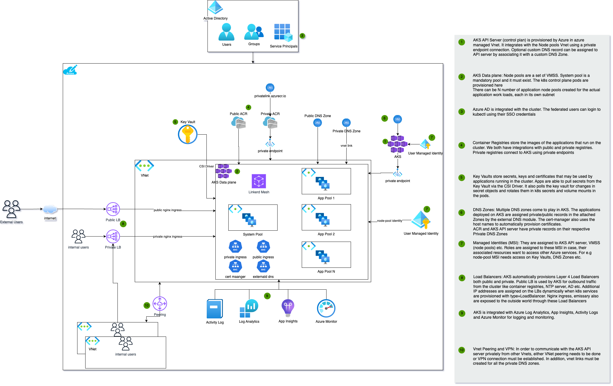

# tf-azurerm-module_reference-kubernetes_cluster

[](https://opensource.org/licenses/Apache-2.0)
[](https://creativecommons.org/licenses/by-nc-nd/4.0/)

## Overview

This terraform module will provision an AKS cluster with other dependencies like Resource Group, Key Vault, ACR, etc. This is a collection module as it will encapsulate other primitive modules like `tf-azurerm-module_primitive-kubernetes_cluster`

Some useful examples can be found in the [examples](./examples) directory that demonstrate the usage of this module to provision different flavors of AKS with different configurations and capabilities.
1. [Private Cluster](./examples/private-cluster/README.md)
2. [Public Cluster](./examples/public-cluster/README.md)

There are also several other add-ons that can be deployed on the AKS cluster to provide additional functionalities. They are found
in the [resources](./resources) directory. Few of the add ons are
1. [Ingress Controller](./resources/ingress-nginx)
2. [Linkerd](./resources/linkerd-servicemesh)
3. [Emissary](./resources/emissary)
4. [Azure AD Integration and RBAC](./resources/azure-ad-integration)
5. [Cert Manager](./resources/cert-manager)
6. [Secrets Controller](./resources/secrets-controller)
7. [Reloaders](./resources/reloaders)
8. [Observability](./resources/observability)
9. [Demo Applications](./resources/demo-apps)

## Architecture
The below diagram shows an architecture of a Private AKS clusters will all add-ons and integrations.



## References
1. [Draw IO diagram source](https://github.com/launchbynttdata/fdoc-drawio)
2. [Primitive module k8s](https://github.com/launchbynttdata/tf-azurerm-module_primitive-kubernetes_cluster)

## Pre-Commit hooks

[.pre-commit-config.yaml](.pre-commit-config.yaml) file defines certain `pre-commit` hooks that are relevant to terraform, golang and common linting tasks. There are no custom hooks added.

`commitlint` hook enforces commit message in certain format. The commit contains the following structural elements, to communicate intent to the consumers of your commit messages:

- **fix**: a commit of the type `fix` patches a bug in your codebase (this correlates with PATCH in Semantic Versioning).
- **feat**: a commit of the type `feat` introduces a new feature to the codebase (this correlates with MINOR in Semantic Versioning).
- **BREAKING CHANGE**: a commit that has a footer `BREAKING CHANGE:`, or appends a `!` after the type/scope, introduces a breaking API change (correlating with MAJOR in Semantic Versioning). A BREAKING CHANGE can be part of commits of any type.
footers other than BREAKING CHANGE: <description> may be provided and follow a convention similar to git trailer format.
- **build**: a commit of the type `build` adds changes that affect the build system or external dependencies (example scopes: gulp, broccoli, npm)
- **chore**: a commit of the type `chore` adds changes that don't modify src or test files
- **ci**: a commit of the type `ci` adds changes to our CI configuration files and scripts (example scopes: Travis, Circle, BrowserStack, SauceLabs)
- **docs**: a commit of the type `docs` adds documentation only changes
- **perf**: a commit of the type `perf` adds code change that improves performance
- **refactor**: a commit of the type `refactor` adds code change that neither fixes a bug nor adds a feature
- **revert**: a commit of the type `revert` reverts a previous commit
- **style**: a commit of the type `style` adds code changes that do not affect the meaning of the code (white-space, formatting, missing semi-colons, etc)
- **test**: a commit of the type `test` adds missing tests or correcting existing tests

Base configuration used for this project is [commitlint-config-conventional (based on the Angular convention)](https://github.com/conventional-changelog/commitlint/tree/master/@commitlint/config-conventional#type-enum)

If you are a developer using vscode, [this](https://marketplace.visualstudio.com/items?itemName=joshbolduc.commitlint) plugin may be helpful.

`detect-secrets-hook` prevents new secrets from being introduced into the baseline. TODO: INSERT DOC LINK ABOUT HOOKS

In order for `pre-commit` hooks to work properly

- You need to have the pre-commit package manager installed. [Here](https://pre-commit.com/#install) are the installation instructions.
- `pre-commit` would install all the hooks when commit message is added by default except for `commitlint` hook. `commitlint` hook would need to be installed manually using the command below

```
pre-commit install --hook-type commit-msg
```

## To test the resource group module locally

1. For development/enhancements to this module locally, you'll need to install all of its components. This is controlled by the `configure` target in the project's [`Makefile`](./Makefile). Before you can run `configure`, familiarize yourself with the variables in the `Makefile` and ensure they're pointing to the right places.

```
make configure
```

This adds in several files and directories that are ignored by `git`. They expose many new Make targets.

2. _THIS STEP APPLIES ONLY TO MICROSOFT AZURE. IF YOU ARE USING A DIFFERENT PLATFORM PLEASE SKIP THIS STEP._ The first target you care about is `env`. This is the common interface for setting up environment variables. The values of the environment variables will be used to authenticate with cloud provider from local development workstation.

`make configure` command will bring down `azure_env.sh` file on local workstation. Devloper would need to modify this file, replace the environment variable values with relevant values.

These environment variables are used by `terratest` integration suit.

Service principle used for authentication(value of ARM_CLIENT_ID) should have below privileges on resource group within the subscription.

```
"Microsoft.Resources/subscriptions/resourceGroups/write"
"Microsoft.Resources/subscriptions/resourceGroups/read"
"Microsoft.Resources/subscriptions/resourceGroups/delete"
```

Then run this make target to set the environment variables on developer workstation.

```
make env
```

3. The first target you care about is `check`.

**Pre-requisites**
Before running this target it is important to ensure that, developer has created files mentioned below on local workstation under root directory of git repository that contains code for primitives/segments. Note that these files are `azure` specific. If primitive/segment under development uses any other cloud provider than azure, this section may not be relevant.
- Login to Azure cli
- Export the below environment variables
```bash
export ARM_ENVIRONMENT=<public|usgovernment>
export ARM_SUBSCRIPTION_ID=<subscription_id>
```
- A file named `provider.tf` with contents below

```
provider "azurerm" {
  features {
    resource_group {
      prevent_deletion_if_contains_resources = false
    }
  }
  skip_provider_registration = true
}

provider "azapi" {
  use_cli     = true
  use_msi     = false
}
```

- A file named `terraform.tfvars` which contains key value pair of variables used.

Note that since these files are added in `gitignore` they would not be checked in into primitive/segment's git repo.

After creating these files, for running tests associated with the primitive/segment, run

```
make check
```

If `make check` target is successful, developer is good to commit the code to primitive/segment's git repo.

`make check` target

- runs `terraform commands` to `lint`,`validate` and `plan` terraform code.
- runs `conftests`. `conftests` make sure `policy` checks are successful.
- runs `terratest`. This is integration test suit.
- runs `opa` tests

# References
1. [Terraform Module](https://github.com/Azure/terraform-azurerm-aks)

# Terradocs

<!-- BEGINNING OF PRE-COMMIT-TERRAFORM DOCS HOOK -->
## Requirements

| Name | Version |
|------|---------|
| <a name="requirement_terraform"></a> [terraform](#requirement\_terraform) | >= 1.5.0, <= 1.5.5 |
| <a name="requirement_azapi"></a> [azapi](#requirement\_azapi) | >= 1.4.0, < 2.0 |
| <a name="requirement_azurerm"></a> [azurerm](#requirement\_azurerm) | ~>3.67 |

## Providers

| Name | Version |
|------|---------|
| <a name="provider_azurerm"></a> [azurerm](#provider\_azurerm) | 3.113.0 |

## Modules

| Name | Source | Version |
|------|--------|---------|
| <a name="module_resource_names"></a> [resource\_names](#module\_resource\_names) | terraform.registry.launch.nttdata.com/module_library/resource_name/launch | ~> 1.0 |
| <a name="module_resource_group"></a> [resource\_group](#module\_resource\_group) | terraform.registry.launch.nttdata.com/module_primitive/resource_group/azurerm | ~> 1.0 |
| <a name="module_key_vault"></a> [key\_vault](#module\_key\_vault) | terraform.registry.launch.nttdata.com/module_primitive/key_vault/azurerm | ~> 1.0 |
| <a name="module_key_vault_role_assignment"></a> [key\_vault\_role\_assignment](#module\_key\_vault\_role\_assignment) | terraform.registry.launch.nttdata.com/module_primitive/role_assignment/azurerm | ~> 1.0 |
| <a name="module_additional_key_vaults_role_assignment"></a> [additional\_key\_vaults\_role\_assignment](#module\_additional\_key\_vaults\_role\_assignment) | terraform.registry.launch.nttdata.com/module_primitive/role_assignment/azurerm | ~> 1.0 |
| <a name="module_cluster_identity"></a> [cluster\_identity](#module\_cluster\_identity) | terraform.registry.launch.nttdata.com/module_primitive/user_managed_identity/azurerm | ~> 1.0 |
| <a name="module_private_cluster_dns_zone"></a> [private\_cluster\_dns\_zone](#module\_private\_cluster\_dns\_zone) | terraform.registry.launch.nttdata.com/module_primitive/private_dns_zone/azurerm | ~> 1.0 |
| <a name="module_vnet_links"></a> [vnet\_links](#module\_vnet\_links) | terraform.registry.launch.nttdata.com/module_primitive/private_dns_vnet_link/azurerm | ~> 1.0 |
| <a name="module_route_table"></a> [route\_table](#module\_route\_table) | terraform.registry.launch.nttdata.com/module_primitive/route_table/azurerm | ~> 1.0 |
| <a name="module_udr_route_table_role_assignment"></a> [udr\_route\_table\_role\_assignment](#module\_udr\_route\_table\_role\_assignment) | terraform.registry.launch.nttdata.com/module_primitive/role_assignment/azurerm | ~> 1.0 |
| <a name="module_routes"></a> [routes](#module\_routes) | terraform.registry.launch.nttdata.com/module_primitive/route/azurerm | ~> 1.0 |
| <a name="module_subnet_route_table_assoc"></a> [subnet\_route\_table\_assoc](#module\_subnet\_route\_table\_assoc) | terraform.registry.launch.nttdata.com/module_primitive/routetable_subnet_association/azurerm | ~> 1.0 |
| <a name="module_aks"></a> [aks](#module\_aks) | terraform.registry.launch.nttdata.com/module_primitive/kubernetes_cluster/azurerm | ~> 2.0 |
| <a name="module_cluster_identity_roles"></a> [cluster\_identity\_roles](#module\_cluster\_identity\_roles) | terraform.registry.launch.nttdata.com/module_primitive/role_assignment/azurerm | ~> 1.0 |
| <a name="module_node_pool_identity_roles"></a> [node\_pool\_identity\_roles](#module\_node\_pool\_identity\_roles) | terraform.registry.launch.nttdata.com/module_primitive/role_assignment/azurerm | ~> 1.0 |
| <a name="module_additional_acr_role_assignments"></a> [additional\_acr\_role\_assignments](#module\_additional\_acr\_role\_assignments) | terraform.registry.launch.nttdata.com/module_primitive/role_assignment/azurerm | ~> 1.0 |
| <a name="module_application_insights"></a> [application\_insights](#module\_application\_insights) | terraform.registry.launch.nttdata.com/module_primitive/application_insights/azurerm | ~> 1.0 |
| <a name="module_prometheus_monitor_workspace"></a> [prometheus\_monitor\_workspace](#module\_prometheus\_monitor\_workspace) | terraform.registry.launch.nttdata.com/module_primitive/monitor_workspace/azurerm | ~> 1.0 |
| <a name="module_prometheus_monitor_data_collection"></a> [prometheus\_monitor\_data\_collection](#module\_prometheus\_monitor\_data\_collection) | terraform.registry.launch.nttdata.com/module_primitive/monitor_prometheus/azurerm | ~> 1.0 |
| <a name="module_prometheus_monitor_workspace_private_dns_zone"></a> [prometheus\_monitor\_workspace\_private\_dns\_zone](#module\_prometheus\_monitor\_workspace\_private\_dns\_zone) | terraform.registry.launch.nttdata.com/module_primitive/private_dns_zone/azurerm | ~> 1.0 |
| <a name="module_prometheus_monitor_workspace_vnet_link"></a> [prometheus\_monitor\_workspace\_vnet\_link](#module\_prometheus\_monitor\_workspace\_vnet\_link) | terraform.registry.launch.nttdata.com/module_primitive/private_dns_vnet_link/azurerm | ~> 1.0 |
| <a name="module_prometheus_monitor_workspace_private_endpoint"></a> [prometheus\_monitor\_workspace\_private\_endpoint](#module\_prometheus\_monitor\_workspace\_private\_endpoint) | terraform.registry.launch.nttdata.com/module_primitive/private_endpoint/azurerm | ~> 1.0 |
| <a name="module_monitor_private_link_scope"></a> [monitor\_private\_link\_scope](#module\_monitor\_private\_link\_scope) | terraform.registry.launch.nttdata.com/module_primitive/azure_monitor_private_link_scope/azurerm | ~> 1.0 |
| <a name="module_monitor_private_link_scope_dns_zone"></a> [monitor\_private\_link\_scope\_dns\_zone](#module\_monitor\_private\_link\_scope\_dns\_zone) | terraform.registry.launch.nttdata.com/module_primitive/private_dns_zone/azurerm | ~> 1.0 |
| <a name="module_monitor_private_link_scope_vnet_link"></a> [monitor\_private\_link\_scope\_vnet\_link](#module\_monitor\_private\_link\_scope\_vnet\_link) | terraform.registry.launch.nttdata.com/module_primitive/private_dns_vnet_link/azurerm | ~> 1.0 |
| <a name="module_monitor_private_link_scope_private_endpoint"></a> [monitor\_private\_link\_scope\_private\_endpoint](#module\_monitor\_private\_link\_scope\_private\_endpoint) | terraform.registry.launch.nttdata.com/module_primitive/private_endpoint/azurerm | ~> 1.0 |
| <a name="module_monitor_private_link_scoped_service"></a> [monitor\_private\_link\_scoped\_service](#module\_monitor\_private\_link\_scoped\_service) | terraform.registry.launch.nttdata.com/module_primitive/monitor_private_link_scoped_service/azurerm | ~> 1.0 |

## Resources

| Name | Type |
|------|------|
| [azurerm_resource_group.rg](https://registry.terraform.io/providers/hashicorp/azurerm/latest/docs/data-sources/resource_group) | data source |

## Inputs

| Name | Description | Type | Default | Required |
|------|-------------|------|---------|:--------:|
| <a name="input_product_family"></a> [product\_family](#input\_product\_family) | (Required) Name of the product family for which the resource is created.<br>    Example: org\_name, department\_name. | `string` | `"dso"` | no |
| <a name="input_product_service"></a> [product\_service](#input\_product\_service) | (Required) Name of the product service for which the resource is created.<br>    For example, backend, frontend, middleware etc. | `string` | `"kube"` | no |
| <a name="input_environment"></a> [environment](#input\_environment) | Environment in which the resource should be provisioned like dev, qa, prod etc. | `string` | `"dev"` | no |
| <a name="input_environment_number"></a> [environment\_number](#input\_environment\_number) | The environment count for the respective environment. Defaults to 000. Increments in value of 1 | `string` | `"000"` | no |
| <a name="input_resource_number"></a> [resource\_number](#input\_resource\_number) | The resource count for the respective resource. Defaults to 000. Increments in value of 1 | `string` | `"000"` | no |
| <a name="input_region"></a> [region](#input\_region) | AWS Region in which the infra needs to be provisioned | `string` | `"eastus"` | no |
| <a name="input_resource_names_map"></a> [resource\_names\_map](#input\_resource\_names\_map) | A map of key to resource\_name that will be used by tf-launch-module\_library-resource\_name to generate resource names | <pre>map(object(<br>    {<br>      name       = string<br>      max_length = optional(number, 60)<br>    }<br>  ))</pre> | <pre>{<br>  "acr": {<br>    "max_length": 60,<br>    "name": "acr"<br>  },<br>  "aks": {<br>    "max_length": 60,<br>    "name": "aks"<br>  },<br>  "application_gateway": {<br>    "max_length": 60,<br>    "name": "appgtw"<br>  },<br>  "application_insights": {<br>    "max_length": 60,<br>    "name": "appins"<br>  },<br>  "cluster_identity": {<br>    "max_length": 60,<br>    "name": "msi"<br>  },<br>  "key_vault": {<br>    "max_length": 24,<br>    "name": "kv"<br>  },<br>  "monitor_private_link_scope": {<br>    "max_length": 60,<br>    "name": "ampls"<br>  },<br>  "monitor_private_link_scope_endpoint": {<br>    "max_length": 60,<br>    "name": "amplspe"<br>  },<br>  "monitor_private_link_scope_service_connection": {<br>    "max_length": 60,<br>    "name": "amplspesc"<br>  },<br>  "prometheus_data_collection_endpoint": {<br>    "max_length": 60,<br>    "name": "promdce"<br>  },<br>  "prometheus_data_collection_rule": {<br>    "max_length": 60,<br>    "name": "promdcr"<br>  },<br>  "prometheus_endpoint": {<br>    "max_length": 60,<br>    "name": "prompe"<br>  },<br>  "prometheus_monitor_workspace": {<br>    "max_length": 60,<br>    "name": "promamw"<br>  },<br>  "prometheus_service_connection": {<br>    "max_length": 60,<br>    "name": "prompesc"<br>  },<br>  "resource_group": {<br>    "max_length": 60,<br>    "name": "rg"<br>  },<br>  "route_table": {<br>    "max_length": 60,<br>    "name": "rt"<br>  }<br>}</pre> | no |
| <a name="input_resource_group_name"></a> [resource\_group\_name](#input\_resource\_group\_name) | Name of the resource group in which the AKS cluster will be created. If not provided, this module will create one | `string` | `null` | no |
| <a name="input_kubernetes_version"></a> [kubernetes\_version](#input\_kubernetes\_version) | Specify which Kubernetes release to use. The default used is the latest Kubernetes version available in the region<br>    Use `az aks get-versions --location <region>` to find the available versions in the region | `string` | `"1.28"` | no |
| <a name="input_network_plugin"></a> [network\_plugin](#input\_network\_plugin) | Network plugin to use for networking. Default is azure. | `string` | `"azure"` | no |
| <a name="input_network_plugin_mode"></a> [network\_plugin\_mode](#input\_network\_plugin\_mode) | (Optional) Specifies the network plugin mode used for building the Kubernetes network. Possible value is `Overlay`. Changing this forces a new resource to be created. | `string` | `null` | no |
| <a name="input_network_policy"></a> [network\_policy](#input\_network\_policy) | (Optional) Sets up network policy to be used with Azure CNI. Network policy allows us to control the traffic flow between pods. Currently supported values are calico and azure. Changing this forces a new resource to be created. | `string` | `null` | no |
| <a name="input_private_cluster_enabled"></a> [private\_cluster\_enabled](#input\_private\_cluster\_enabled) | If true cluster API server will be exposed only on internal IP address and available only in cluster vnet. | `bool` | `false` | no |
| <a name="input_private_cluster_public_fqdn_enabled"></a> [private\_cluster\_public\_fqdn\_enabled](#input\_private\_cluster\_public\_fqdn\_enabled) | (Optional) Specifies whether a Public FQDN for this Private Cluster should be added. Defaults to `false`. | `bool` | `false` | no |
| <a name="input_additional_vnet_links"></a> [additional\_vnet\_links](#input\_additional\_vnet\_links) | A list of VNET IDs for which vnet links to be created with the private AKS cluster DNS Zone. Applicable only when private\_cluster\_enabled is true. | `map(string)` | `{}` | no |
| <a name="input_cluster_identity_role_assignments"></a> [cluster\_identity\_role\_assignments](#input\_cluster\_identity\_role\_assignments) | A map of role assignments to be associated with the cluster identity<br>    Should be of the format<br>    {<br>      private-dns = ["Private DNS Zone Contributor", "<private-dns-zone-id>"]<br>      dns = ["DNS Zone Contributor", "<dns-zone-id>"]<br>    } | `map(list(string))` | `{}` | no |
| <a name="input_node_pool_identity_role_assignments"></a> [node\_pool\_identity\_role\_assignments](#input\_node\_pool\_identity\_role\_assignments) | A map of role assignments to be associated with the node-pool identity<br>    Should be of the format<br>    {<br>      private-dns = ["Private DNS Zone Contributor", "<private-dns-zone-id>"]<br>      dns = ["DNS Zone Contributor", "<dns-zone-id>"]<br>    } | `map(list(string))` | `{}` | no |
| <a name="input_dns_zone_suffix"></a> [dns\_zone\_suffix](#input\_dns\_zone\_suffix) | The DNS Zone suffix for AKS Cluster private DNS Zone. Default is `azmk8s.io` for Public Cloud<br>    For gov cloud it is `cx.aks.containerservice.azure.us` | `string` | `"azmk8s.io"` | no |
| <a name="input_vnet_subnet_id"></a> [vnet\_subnet\_id](#input\_vnet\_subnet\_id) | (Optional) The ID of a Subnet where the Kubernetes Node Pool should exist. Changing this forces a new resource to be created. | `string` | `null` | no |
| <a name="input_net_profile_dns_service_ip"></a> [net\_profile\_dns\_service\_ip](#input\_net\_profile\_dns\_service\_ip) | (Optional) IP address within the Kubernetes service address range that will be used by cluster service discovery (kube-dns). Changing this forces a new resource to be created. | `string` | `null` | no |
| <a name="input_net_profile_outbound_type"></a> [net\_profile\_outbound\_type](#input\_net\_profile\_outbound\_type) | (Optional) The outbound (egress) routing method which should be used for this Kubernetes Cluster. Possible values are<br>    loadBalancer and userDefinedRouting. Defaults to loadBalancer.<br>    if `userDefinedRouting` is selected, `user_defined_routing` variable is required. | `string` | `"loadBalancer"` | no |
| <a name="input_user_defined_routing"></a> [user\_defined\_routing](#input\_user\_defined\_routing) | This variable is required only when net\_profile\_outbound\_type is set to `userDefinedRouting`<br>    The private IP address of the Azure Firewall instance is needed to create route in custom Route table | <pre>object({<br>    azure_firewall_private_ip_address = string<br>  })</pre> | `null` | no |
| <a name="input_net_profile_pod_cidr"></a> [net\_profile\_pod\_cidr](#input\_net\_profile\_pod\_cidr) | (Optional) The CIDR to use for pod IP addresses. This field can only be set when network\_plugin is set to kubenet. Changing this forces a new resource to be created. | `string` | `null` | no |
| <a name="input_net_profile_service_cidr"></a> [net\_profile\_service\_cidr](#input\_net\_profile\_service\_cidr) | (Optional) The Network Range used by the Kubernetes service. Changing this forces a new resource to be created. | `string` | `null` | no |
| <a name="input_agents_availability_zones"></a> [agents\_availability\_zones](#input\_agents\_availability\_zones) | (Optional) A list of Availability Zones across which the Node Pool should be spread. Changing this forces a new resource to be created. | `list(string)` | `null` | no |
| <a name="input_agents_count"></a> [agents\_count](#input\_agents\_count) | The number of Agents that should exist in the Agent Pool. Please set `agents_count` `null` while `enable_auto_scaling` is `true` to avoid possible `agents_count` changes. | `number` | `2` | no |
| <a name="input_agents_labels"></a> [agents\_labels](#input\_agents\_labels) | (Optional) A map of Kubernetes labels which should be applied to nodes in the Default Node Pool. Changing this forces a new resource to be created. | `map(string)` | `{}` | no |
| <a name="input_agents_max_count"></a> [agents\_max\_count](#input\_agents\_max\_count) | Maximum number of nodes in a pool | `number` | `null` | no |
| <a name="input_agents_max_pods"></a> [agents\_max\_pods](#input\_agents\_max\_pods) | (Optional) The maximum number of pods that can run on each agent. Changing this forces a new resource to be created. | `number` | `null` | no |
| <a name="input_agents_min_count"></a> [agents\_min\_count](#input\_agents\_min\_count) | Minimum number of nodes in a pool | `number` | `null` | no |
| <a name="input_agents_pool_max_surge"></a> [agents\_pool\_max\_surge](#input\_agents\_pool\_max\_surge) | The maximum number or percentage of nodes which will be added to the Default Node Pool size during an upgrade. | `string` | `null` | no |
| <a name="input_agents_pool_linux_os_configs"></a> [agents\_pool\_linux\_os\_configs](#input\_agents\_pool\_linux\_os\_configs) | list(object({<br>  sysctl\_configs = optional(list(object({<br>    fs\_aio\_max\_nr                      = (Optional) The sysctl setting fs.aio-max-nr. Must be between `65536` and `6553500`. Changing this forces a new resource to be created.<br>    fs\_file\_max                        = (Optional) The sysctl setting fs.file-max. Must be between `8192` and `12000500`. Changing this forces a new resource to be created.<br>    fs\_inotify\_max\_user\_watches        = (Optional) The sysctl setting fs.inotify.max\_user\_watches. Must be between `781250` and `2097152`. Changing this forces a new resource to be created.<br>    fs\_nr\_open                         = (Optional) The sysctl setting fs.nr\_open. Must be between `8192` and `20000500`. Changing this forces a new resource to be created.<br>    kernel\_threads\_max                 = (Optional) The sysctl setting kernel.threads-max. Must be between `20` and `513785`. Changing this forces a new resource to be created.<br>    net\_core\_netdev\_max\_backlog        = (Optional) The sysctl setting net.core.netdev\_max\_backlog. Must be between `1000` and `3240000`. Changing this forces a new resource to be created.<br>    net\_core\_optmem\_max                = (Optional) The sysctl setting net.core.optmem\_max. Must be between `20480` and `4194304`. Changing this forces a new resource to be created.<br>    net\_core\_rmem\_default              = (Optional) The sysctl setting net.core.rmem\_default. Must be between `212992` and `134217728`. Changing this forces a new resource to be created.<br>    net\_core\_rmem\_max                  = (Optional) The sysctl setting net.core.rmem\_max. Must be between `212992` and `134217728`. Changing this forces a new resource to be created.<br>    net\_core\_somaxconn                 = (Optional) The sysctl setting net.core.somaxconn. Must be between `4096` and `3240000`. Changing this forces a new resource to be created.<br>    net\_core\_wmem\_default              = (Optional) The sysctl setting net.core.wmem\_default. Must be between `212992` and `134217728`. Changing this forces a new resource to be created.<br>    net\_core\_wmem\_max                  = (Optional) The sysctl setting net.core.wmem\_max. Must be between `212992` and `134217728`. Changing this forces a new resource to be created.<br>    net\_ipv4\_ip\_local\_port\_range\_min   = (Optional) The sysctl setting net.ipv4.ip\_local\_port\_range max value. Must be between `1024` and `60999`. Changing this forces a new resource to be created.<br>    net\_ipv4\_ip\_local\_port\_range\_max   = (Optional) The sysctl setting net.ipv4.ip\_local\_port\_range min value. Must be between `1024` and `60999`. Changing this forces a new resource to be created.<br>    net\_ipv4\_neigh\_default\_gc\_thresh1  = (Optional) The sysctl setting net.ipv4.neigh.default.gc\_thresh1. Must be between `128` and `80000`. Changing this forces a new resource to be created.<br>    net\_ipv4\_neigh\_default\_gc\_thresh2  = (Optional) The sysctl setting net.ipv4.neigh.default.gc\_thresh2. Must be between `512` and `90000`. Changing this forces a new resource to be created.<br>    net\_ipv4\_neigh\_default\_gc\_thresh3  = (Optional) The sysctl setting net.ipv4.neigh.default.gc\_thresh3. Must be between `1024` and `100000`. Changing this forces a new resource to be created.<br>    net\_ipv4\_tcp\_fin\_timeout           = (Optional) The sysctl setting net.ipv4.tcp\_fin\_timeout. Must be between `5` and `120`. Changing this forces a new resource to be created.<br>    net\_ipv4\_tcp\_keepalive\_intvl       = (Optional) The sysctl setting net.ipv4.tcp\_keepalive\_intvl. Must be between `10` and `75`. Changing this forces a new resource to be created.<br>    net\_ipv4\_tcp\_keepalive\_probes      = (Optional) The sysctl setting net.ipv4.tcp\_keepalive\_probes. Must be between `1` and `15`. Changing this forces a new resource to be created.<br>    net\_ipv4\_tcp\_keepalive\_time        = (Optional) The sysctl setting net.ipv4.tcp\_keepalive\_time. Must be between `30` and `432000`. Changing this forces a new resource to be created.<br>    net\_ipv4\_tcp\_max\_syn\_backlog       = (Optional) The sysctl setting net.ipv4.tcp\_max\_syn\_backlog. Must be between `128` and `3240000`. Changing this forces a new resource to be created.<br>    net\_ipv4\_tcp\_max\_tw\_buckets        = (Optional) The sysctl setting net.ipv4.tcp\_max\_tw\_buckets. Must be between `8000` and `1440000`. Changing this forces a new resource to be created.<br>    net\_ipv4\_tcp\_tw\_reuse              = (Optional) The sysctl setting net.ipv4.tcp\_tw\_reuse. Changing this forces a new resource to be created.<br>    net\_netfilter\_nf\_conntrack\_buckets = (Optional) The sysctl setting net.netfilter.nf\_conntrack\_buckets. Must be between `65536` and `147456`. Changing this forces a new resource to be created.<br>    net\_netfilter\_nf\_conntrack\_max     = (Optional) The sysctl setting net.netfilter.nf\_conntrack\_max. Must be between `131072` and `1048576`. Changing this forces a new resource to be created.<br>    vm\_max\_map\_count                   = (Optional) The sysctl setting vm.max\_map\_count. Must be between `65530` and `262144`. Changing this forces a new resource to be created.<br>    vm\_swappiness                      = (Optional) The sysctl setting vm.swappiness. Must be between `0` and `100`. Changing this forces a new resource to be created.<br>    vm\_vfs\_cache\_pressure              = (Optional) The sysctl setting vm.vfs\_cache\_pressure. Must be between `0` and `100`. Changing this forces a new resource to be created.<br>  })), [])<br>  transparent\_huge\_page\_enabled = (Optional) Specifies the Transparent Huge Page enabled configuration. Possible values are `always`, `madvise` and `never`. Changing this forces a new resource to be created.<br>  transparent\_huge\_page\_defrag  = (Optional) specifies the defrag configuration for Transparent Huge Page. Possible values are `always`, `defer`, `defer+madvise`, `madvise` and `never`. Changing this forces a new resource to be created.<br>  swap\_file\_size\_mb             = (Optional) Specifies the size of the swap file on each node in MB. Changing this forces a new resource to be created.<br>})) | <pre>list(object({<br>    sysctl_configs = optional(list(object({<br>      fs_aio_max_nr                      = optional(number)<br>      fs_file_max                        = optional(number)<br>      fs_inotify_max_user_watches        = optional(number)<br>      fs_nr_open                         = optional(number)<br>      kernel_threads_max                 = optional(number)<br>      net_core_netdev_max_backlog        = optional(number)<br>      net_core_optmem_max                = optional(number)<br>      net_core_rmem_default              = optional(number)<br>      net_core_rmem_max                  = optional(number)<br>      net_core_somaxconn                 = optional(number)<br>      net_core_wmem_default              = optional(number)<br>      net_core_wmem_max                  = optional(number)<br>      net_ipv4_ip_local_port_range_min   = optional(number)<br>      net_ipv4_ip_local_port_range_max   = optional(number)<br>      net_ipv4_neigh_default_gc_thresh1  = optional(number)<br>      net_ipv4_neigh_default_gc_thresh2  = optional(number)<br>      net_ipv4_neigh_default_gc_thresh3  = optional(number)<br>      net_ipv4_tcp_fin_timeout           = optional(number)<br>      net_ipv4_tcp_keepalive_intvl       = optional(number)<br>      net_ipv4_tcp_keepalive_probes      = optional(number)<br>      net_ipv4_tcp_keepalive_time        = optional(number)<br>      net_ipv4_tcp_max_syn_backlog       = optional(number)<br>      net_ipv4_tcp_max_tw_buckets        = optional(number)<br>      net_ipv4_tcp_tw_reuse              = optional(bool)<br>      net_netfilter_nf_conntrack_buckets = optional(number)<br>      net_netfilter_nf_conntrack_max     = optional(number)<br>      vm_max_map_count                   = optional(number)<br>      vm_swappiness                      = optional(number)<br>      vm_vfs_cache_pressure              = optional(number)<br>    })), [])<br>    transparent_huge_page_enabled = optional(string)<br>    transparent_huge_page_defrag  = optional(string)<br>    swap_file_size_mb             = optional(number)<br>  }))</pre> | `[]` | no |
| <a name="input_agents_pool_name"></a> [agents\_pool\_name](#input\_agents\_pool\_name) | The default Azure AKS agentpool (nodepool) name. | `string` | `"nodepool"` | no |
| <a name="input_agents_proximity_placement_group_id"></a> [agents\_proximity\_placement\_group\_id](#input\_agents\_proximity\_placement\_group\_id) | (Optional) The ID of the Proximity Placement Group of the default Azure AKS agentpool (nodepool). Changing this forces a new resource to be created. | `string` | `null` | no |
| <a name="input_agents_size"></a> [agents\_size](#input\_agents\_size) | The default virtual machine size for the Kubernetes agents. Changing this without specifying `var.temporary_name_for_rotation` forces a new resource to be created. | `string` | `"Standard_D2_v2"` | no |
| <a name="input_agents_tags"></a> [agents\_tags](#input\_agents\_tags) | (Optional) A mapping of tags to assign to the Node Pool. | `map(string)` | `{}` | no |
| <a name="input_agents_taints"></a> [agents\_taints](#input\_agents\_taints) | (Optional) A list of the taints added to new nodes during node pool create and scale. Changing this forces a new resource to be created. | `list(string)` | `null` | no |
| <a name="input_agents_type"></a> [agents\_type](#input\_agents\_type) | (Optional) The type of Node Pool which should be created. Possible values are AvailabilitySet and VirtualMachineScaleSets. Defaults to VirtualMachineScaleSets. | `string` | `"VirtualMachineScaleSets"` | no |
| <a name="input_api_server_authorized_ip_ranges"></a> [api\_server\_authorized\_ip\_ranges](#input\_api\_server\_authorized\_ip\_ranges) | (Optional) The IP ranges to allow for incoming traffic to the server nodes. | `set(string)` | `null` | no |
| <a name="input_api_server_subnet_id"></a> [api\_server\_subnet\_id](#input\_api\_server\_subnet\_id) | (Optional) The ID of the Subnet where the API server endpoint is delegated to. | `string` | `null` | no |
| <a name="input_attached_acr_id_map"></a> [attached\_acr\_id\_map](#input\_attached\_acr\_id\_map) | Azure Container Registry ids that need an authentication mechanism with Azure Kubernetes Service (AKS). Map key must be static string as acr's name, the value is acr's resource id. Changing this forces some new resources to be created. | `map(string)` | `{}` | no |
| <a name="input_enable_auto_scaling"></a> [enable\_auto\_scaling](#input\_enable\_auto\_scaling) | Enable node pool autoscaling. Please set `agents_count` `null` while `enable_auto_scaling` is `true` to avoid possible `agents_count` changes. | `bool` | `false` | no |
| <a name="input_auto_scaler_profile_balance_similar_node_groups"></a> [auto\_scaler\_profile\_balance\_similar\_node\_groups](#input\_auto\_scaler\_profile\_balance\_similar\_node\_groups) | Detect similar node groups and balance the number of nodes between them. Defaults to `false`. | `bool` | `false` | no |
| <a name="input_auto_scaler_profile_empty_bulk_delete_max"></a> [auto\_scaler\_profile\_empty\_bulk\_delete\_max](#input\_auto\_scaler\_profile\_empty\_bulk\_delete\_max) | Maximum number of empty nodes that can be deleted at the same time. Defaults to `10`. | `number` | `10` | no |
| <a name="input_auto_scaler_profile_enabled"></a> [auto\_scaler\_profile\_enabled](#input\_auto\_scaler\_profile\_enabled) | Enable configuring the auto scaler profile | `bool` | `false` | no |
| <a name="input_auto_scaler_profile_expander"></a> [auto\_scaler\_profile\_expander](#input\_auto\_scaler\_profile\_expander) | Expander to use. Possible values are `least-waste`, `priority`, `most-pods` and `random`. Defaults to `random`. | `string` | `"random"` | no |
| <a name="input_auto_scaler_profile_max_graceful_termination_sec"></a> [auto\_scaler\_profile\_max\_graceful\_termination\_sec](#input\_auto\_scaler\_profile\_max\_graceful\_termination\_sec) | Maximum number of seconds the cluster autoscaler waits for pod termination when trying to scale down a node. Defaults to `600`. | `string` | `"600"` | no |
| <a name="input_auto_scaler_profile_max_node_provisioning_time"></a> [auto\_scaler\_profile\_max\_node\_provisioning\_time](#input\_auto\_scaler\_profile\_max\_node\_provisioning\_time) | Maximum time the autoscaler waits for a node to be provisioned. Defaults to `15m`. | `string` | `"15m"` | no |
| <a name="input_auto_scaler_profile_max_unready_nodes"></a> [auto\_scaler\_profile\_max\_unready\_nodes](#input\_auto\_scaler\_profile\_max\_unready\_nodes) | Maximum Number of allowed unready nodes. Defaults to `3`. | `number` | `3` | no |
| <a name="input_auto_scaler_profile_max_unready_percentage"></a> [auto\_scaler\_profile\_max\_unready\_percentage](#input\_auto\_scaler\_profile\_max\_unready\_percentage) | Maximum percentage of unready nodes the cluster autoscaler will stop if the percentage is exceeded. Defaults to `45`. | `number` | `45` | no |
| <a name="input_auto_scaler_profile_new_pod_scale_up_delay"></a> [auto\_scaler\_profile\_new\_pod\_scale\_up\_delay](#input\_auto\_scaler\_profile\_new\_pod\_scale\_up\_delay) | For scenarios like burst/batch scale where you don't want CA to act before the kubernetes scheduler could schedule all the pods, you can tell CA to ignore unscheduled pods before they're a certain age. Defaults to `10s`. | `string` | `"10s"` | no |
| <a name="input_auto_scaler_profile_scale_down_delay_after_add"></a> [auto\_scaler\_profile\_scale\_down\_delay\_after\_add](#input\_auto\_scaler\_profile\_scale\_down\_delay\_after\_add) | How long after the scale up of AKS nodes the scale down evaluation resumes. Defaults to `10m`. | `string` | `"10m"` | no |
| <a name="input_auto_scaler_profile_scale_down_delay_after_delete"></a> [auto\_scaler\_profile\_scale\_down\_delay\_after\_delete](#input\_auto\_scaler\_profile\_scale\_down\_delay\_after\_delete) | How long after node deletion that scale down evaluation resumes. Defaults to the value used for `scan_interval`. | `string` | `null` | no |
| <a name="input_auto_scaler_profile_scale_down_delay_after_failure"></a> [auto\_scaler\_profile\_scale\_down\_delay\_after\_failure](#input\_auto\_scaler\_profile\_scale\_down\_delay\_after\_failure) | How long after scale down failure that scale down evaluation resumes. Defaults to `3m`. | `string` | `"3m"` | no |
| <a name="input_auto_scaler_profile_scale_down_unneeded"></a> [auto\_scaler\_profile\_scale\_down\_unneeded](#input\_auto\_scaler\_profile\_scale\_down\_unneeded) | How long a node should be unneeded before it is eligible for scale down. Defaults to `10m`. | `string` | `"10m"` | no |
| <a name="input_auto_scaler_profile_scale_down_unready"></a> [auto\_scaler\_profile\_scale\_down\_unready](#input\_auto\_scaler\_profile\_scale\_down\_unready) | How long an unready node should be unneeded before it is eligible for scale down. Defaults to `20m`. | `string` | `"20m"` | no |
| <a name="input_auto_scaler_profile_scale_down_utilization_threshold"></a> [auto\_scaler\_profile\_scale\_down\_utilization\_threshold](#input\_auto\_scaler\_profile\_scale\_down\_utilization\_threshold) | Node utilization level, defined as sum of requested resources divided by capacity, below which a node can be considered for scale down. Defaults to `0.5`. | `string` | `"0.5"` | no |
| <a name="input_auto_scaler_profile_scan_interval"></a> [auto\_scaler\_profile\_scan\_interval](#input\_auto\_scaler\_profile\_scan\_interval) | How often the AKS Cluster should be re-evaluated for scale up/down. Defaults to `10s`. | `string` | `"10s"` | no |
| <a name="input_auto_scaler_profile_skip_nodes_with_local_storage"></a> [auto\_scaler\_profile\_skip\_nodes\_with\_local\_storage](#input\_auto\_scaler\_profile\_skip\_nodes\_with\_local\_storage) | If `true` cluster autoscaler will never delete nodes with pods with local storage, for example, EmptyDir or HostPath. Defaults to `true`. | `bool` | `true` | no |
| <a name="input_auto_scaler_profile_skip_nodes_with_system_pods"></a> [auto\_scaler\_profile\_skip\_nodes\_with\_system\_pods](#input\_auto\_scaler\_profile\_skip\_nodes\_with\_system\_pods) | If `true` cluster autoscaler will never delete nodes with pods from kube-system (except for DaemonSet or mirror pods). Defaults to `true`. | `bool` | `true` | no |
| <a name="input_os_disk_size_gb"></a> [os\_disk\_size\_gb](#input\_os\_disk\_size\_gb) | Disk size of nodes in GBs. | `number` | `50` | no |
| <a name="input_os_disk_type"></a> [os\_disk\_type](#input\_os\_disk\_type) | The type of disk which should be used for the Operating System. Possible values are `Ephemeral` and `Managed`. Defaults to `Managed`. Changing this forces a new resource to be created. | `string` | `"Managed"` | no |
| <a name="input_os_sku"></a> [os\_sku](#input\_os\_sku) | (Optional) Specifies the OS SKU used by the agent pool. Possible values include: `Ubuntu`, `CBLMariner`, `Mariner`, `Windows2019`, `Windows2022`. If not specified, the default is `Ubuntu` if OSType=Linux or `Windows2019` if OSType=Windows. And the default Windows OSSKU will be changed to `Windows2022` after Windows2019 is deprecated. Changing this forces a new resource to be created. | `string` | `null` | no |
| <a name="input_pod_subnet_id"></a> [pod\_subnet\_id](#input\_pod\_subnet\_id) | (Optional) The ID of the Subnet where the pods in the default Node Pool should exist. Changing this forces a new resource to be created. | `string` | `null` | no |
| <a name="input_rbac_aad"></a> [rbac\_aad](#input\_rbac\_aad) | (Optional) Is Azure Active Directory integration enabled? | `bool` | `false` | no |
| <a name="input_rbac_aad_admin_group_object_ids"></a> [rbac\_aad\_admin\_group\_object\_ids](#input\_rbac\_aad\_admin\_group\_object\_ids) | Object ID of groups with admin access. | `list(string)` | `null` | no |
| <a name="input_rbac_aad_azure_rbac_enabled"></a> [rbac\_aad\_azure\_rbac\_enabled](#input\_rbac\_aad\_azure\_rbac\_enabled) | (Optional) Is Role Based Access Control based on Azure AD enabled? | `bool` | `null` | no |
| <a name="input_rbac_aad_client_app_id"></a> [rbac\_aad\_client\_app\_id](#input\_rbac\_aad\_client\_app\_id) | The Client ID of an Azure Active Directory Application. | `string` | `null` | no |
| <a name="input_rbac_aad_managed"></a> [rbac\_aad\_managed](#input\_rbac\_aad\_managed) | Is the Azure Active Directory integration Managed, meaning that Azure will create/manage the Service Principal used for integration. | `bool` | `false` | no |
| <a name="input_rbac_aad_server_app_id"></a> [rbac\_aad\_server\_app\_id](#input\_rbac\_aad\_server\_app\_id) | The Server ID of an Azure Active Directory Application. | `string` | `null` | no |
| <a name="input_rbac_aad_server_app_secret"></a> [rbac\_aad\_server\_app\_secret](#input\_rbac\_aad\_server\_app\_secret) | The Server Secret of an Azure Active Directory Application. | `string` | `null` | no |
| <a name="input_rbac_aad_tenant_id"></a> [rbac\_aad\_tenant\_id](#input\_rbac\_aad\_tenant\_id) | (Optional) The Tenant ID used for Azure Active Directory Application. If this isn't specified the Tenant ID of the current Subscription is used. | `string` | `null` | no |
| <a name="input_role_based_access_control_enabled"></a> [role\_based\_access\_control\_enabled](#input\_role\_based\_access\_control\_enabled) | Enable Role Based Access Control. If this is disabled, then identity\_type='SystemAssigned' by default | `bool` | `false` | no |
| <a name="input_local_account_disabled"></a> [local\_account\_disabled](#input\_local\_account\_disabled) | (Optional) - If `true` local accounts will be disabled. Defaults to `false`. See [the documentation](https://docs.microsoft.com/azure/aks/managed-aad#disable-local-accounts) for more information. | `bool` | `null` | no |
| <a name="input_oidc_issuer_enabled"></a> [oidc\_issuer\_enabled](#input\_oidc\_issuer\_enabled) | Enable or Disable the OIDC issuer URL. Defaults to false. | `bool` | `false` | no |
| <a name="input_workload_identity_enabled"></a> [workload\_identity\_enabled](#input\_workload\_identity\_enabled) | Enable or Disable Workload Identity. If enabled, oidc\_issuer\_enabled must be true. Defaults to false. | `bool` | `false` | no |
| <a name="input_cluster_log_analytics_workspace_name"></a> [cluster\_log\_analytics\_workspace\_name](#input\_cluster\_log\_analytics\_workspace\_name) | (Optional) The name of the Analytics workspace to create | `string` | `null` | no |
| <a name="input_log_analytics_workspace"></a> [log\_analytics\_workspace](#input\_log\_analytics\_workspace) | (Optional) Existing azurerm\_log\_analytics\_workspace to attach azurerm\_log\_analytics\_solution. Providing the config disables creation of azurerm\_log\_analytics\_workspace. | <pre>object({<br>    id                  = string<br>    name                = string<br>    location            = optional(string)<br>    resource_group_name = optional(string)<br>  })</pre> | `null` | no |
| <a name="input_log_analytics_workspace_allow_resource_only_permissions"></a> [log\_analytics\_workspace\_allow\_resource\_only\_permissions](#input\_log\_analytics\_workspace\_allow\_resource\_only\_permissions) | (Optional) Specifies if the log Analytics Workspace allow users accessing to data associated with resources they have permission to view, without permission to workspace. Defaults to `true`. | `bool` | `null` | no |
| <a name="input_log_analytics_workspace_cmk_for_query_forced"></a> [log\_analytics\_workspace\_cmk\_for\_query\_forced](#input\_log\_analytics\_workspace\_cmk\_for\_query\_forced) | (Optional) Is Customer Managed Storage mandatory for query management? | `bool` | `null` | no |
| <a name="input_log_analytics_workspace_daily_quota_gb"></a> [log\_analytics\_workspace\_daily\_quota\_gb](#input\_log\_analytics\_workspace\_daily\_quota\_gb) | (Optional) The workspace daily quota for ingestion in GB. Defaults to -1 (unlimited) if omitted. | `number` | `null` | no |
| <a name="input_log_analytics_workspace_data_collection_rule_id"></a> [log\_analytics\_workspace\_data\_collection\_rule\_id](#input\_log\_analytics\_workspace\_data\_collection\_rule\_id) | (Optional) The ID of the Data Collection Rule to use for this workspace. | `string` | `null` | no |
| <a name="input_log_analytics_workspace_enabled"></a> [log\_analytics\_workspace\_enabled](#input\_log\_analytics\_workspace\_enabled) | Enable the integration of azurerm\_log\_analytics\_workspace and azurerm\_log\_analytics\_solution: https://docs.microsoft.com/en-us/azure/azure-monitor/containers/container-insights-onboard | `bool` | `true` | no |
| <a name="input_log_analytics_workspace_resource_group_name"></a> [log\_analytics\_workspace\_resource\_group\_name](#input\_log\_analytics\_workspace\_resource\_group\_name) | (Optional) Resource group name to create azurerm\_log\_analytics\_solution. | `string` | `null` | no |
| <a name="input_log_analytics_workspace_sku"></a> [log\_analytics\_workspace\_sku](#input\_log\_analytics\_workspace\_sku) | The SKU (pricing level) of the Log Analytics workspace. For new subscriptions the SKU should be set to PerGB2018 | `string` | `"PerGB2018"` | no |
| <a name="input_log_analytics_workspace_identity"></a> [log\_analytics\_workspace\_identity](#input\_log\_analytics\_workspace\_identity) | - `identity_ids` - (Optional) Specifies a list of user managed identity ids to be assigned. Required if `type` is `UserAssigned`.<br>- `type` - (Required) Specifies the identity type of the Log Analytics Workspace. Possible values are `SystemAssigned` (where Azure will generate a Service Principal for you) and `UserAssigned` where you can specify the Service Principal IDs in the `identity_ids` field. | <pre>object({<br>    identity_ids = optional(set(string))<br>    type         = string<br>  })</pre> | `null` | no |
| <a name="input_log_analytics_workspace_immediate_data_purge_on_30_days_enabled"></a> [log\_analytics\_workspace\_immediate\_data\_purge\_on\_30\_days\_enabled](#input\_log\_analytics\_workspace\_immediate\_data\_purge\_on\_30\_days\_enabled) | (Optional) Whether to remove the data in the Log Analytics Workspace immediately after 30 days. | `bool` | `null` | no |
| <a name="input_log_analytics_workspace_internet_ingestion_enabled"></a> [log\_analytics\_workspace\_internet\_ingestion\_enabled](#input\_log\_analytics\_workspace\_internet\_ingestion\_enabled) | (Optional) Should the Log Analytics Workspace support ingestion over the Public Internet? Defaults to `true`. | `bool` | `null` | no |
| <a name="input_log_analytics_workspace_internet_query_enabled"></a> [log\_analytics\_workspace\_internet\_query\_enabled](#input\_log\_analytics\_workspace\_internet\_query\_enabled) | (Optional) Should the Log Analytics Workspace support querying over the Public Internet? Defaults to `true`. | `bool` | `null` | no |
| <a name="input_log_analytics_workspace_local_authentication_disabled"></a> [log\_analytics\_workspace\_local\_authentication\_disabled](#input\_log\_analytics\_workspace\_local\_authentication\_disabled) | (Optional) Specifies if the log Analytics workspace should enforce authentication using Azure AD. Defaults to `false`. | `bool` | `null` | no |
| <a name="input_log_analytics_workspace_reservation_capacity_in_gb_per_day"></a> [log\_analytics\_workspace\_reservation\_capacity\_in\_gb\_per\_day](#input\_log\_analytics\_workspace\_reservation\_capacity\_in\_gb\_per\_day) | (Optional) The capacity reservation level in GB for this workspace. Possible values are `100`, `200`, `300`, `400`, `500`, `1000`, `2000` and `5000`. | `number` | `null` | no |
| <a name="input_log_retention_in_days"></a> [log\_retention\_in\_days](#input\_log\_retention\_in\_days) | The retention period for the logs in days | `number` | `30` | no |
| <a name="input_node_pools"></a> [node\_pools](#input\_node\_pools) | A map of node pools that need to be created and attached on the Kubernetes cluster. The key of the map can be the name of the node pool, and the key must be static string. The value of the map is a `node_pool` block as defined below:<br>map(object({<br>  name                          = (Required) The name of the Node Pool which should be created within the Kubernetes Cluster. Changing this forces a new resource to be created. A Windows Node Pool cannot have a `name` longer than 6 characters. A random suffix of 4 characters is always added to the name to avoid clashes during recreates.<br>  node\_count                    = (Optional) The initial number of nodes which should exist within this Node Pool. Valid values are between `0` and `1000` (inclusive) for user pools and between `1` and `1000` (inclusive) for system pools and must be a value in the range `min_count` - `max_count`.<br>  tags                          = (Optional) A mapping of tags to assign to the resource. At this time there's a bug in the AKS API where Tags for a Node Pool are not stored in the correct case - you [may wish to use Terraform's `ignore_changes` functionality to ignore changes to the casing](https://www.terraform.io/language/meta-arguments/lifecycle#ignore_changess) until this is fixed in the AKS API.<br>  vm\_size                       = (Required) The SKU which should be used for the Virtual Machines used in this Node Pool. Changing this forces a new resource to be created.<br>  host\_group\_id                 = (Optional) The fully qualified resource ID of the Dedicated Host Group to provision virtual machines from. Changing this forces a new resource to be created.<br>  capacity\_reservation\_group\_id = (Optional) Specifies the ID of the Capacity Reservation Group where this Node Pool should exist. Changing this forces a new resource to be created.<br>  custom\_ca\_trust\_enabled       = (Optional) Specifies whether to trust a Custom CA. This requires that the Preview Feature `Microsoft.ContainerService/CustomCATrustPreview` is enabled and the Resource Provider is re-registered, see [the documentation](https://learn.microsoft.com/en-us/azure/aks/custom-certificate-authority) for more information.<br>  enable\_auto\_scaling           = (Optional) Whether to enable [auto-scaler](https://docs.microsoft.com/azure/aks/cluster-autoscaler).<br>  enable\_host\_encryption        = (Optional) Should the nodes in this Node Pool have host encryption enabled? Changing this forces a new resource to be created.<br>  enable\_node\_public\_ip         = (Optional) Should each node have a Public IP Address? Changing this forces a new resource to be created.<br>  eviction\_policy               = (Optional) The Eviction Policy which should be used for Virtual Machines within the Virtual Machine Scale Set powering this Node Pool. Possible values are `Deallocate` and `Delete`. Changing this forces a new resource to be created. An Eviction Policy can only be configured when `priority` is set to `Spot` and will default to `Delete` unless otherwise specified.<br>  gpu\_instance                  = (Optional) Specifies the GPU MIG instance profile for supported GPU VM SKU. The allowed values are `MIG1g`, `MIG2g`, `MIG3g`, `MIG4g` and `MIG7g`. Changing this forces a new resource to be created.<br>  kubelet\_config = optional(object({<br>    cpu\_manager\_policy        = (Optional) Specifies the CPU Manager policy to use. Possible values are `none` and `static`, Changing this forces a new resource to be created.<br>    cpu\_cfs\_quota\_enabled     = (Optional) Is CPU CFS quota enforcement for containers enabled? Changing this forces a new resource to be created.<br>    cpu\_cfs\_quota\_period      = (Optional) Specifies the CPU CFS quota period value. Changing this forces a new resource to be created.<br>    image\_gc\_high\_threshold   = (Optional) Specifies the percent of disk usage above which image garbage collection is always run. Must be between `0` and `100`. Changing this forces a new resource to be created.<br>    image\_gc\_low\_threshold    = (Optional) Specifies the percent of disk usage lower than which image garbage collection is never run. Must be between `0` and `100`. Changing this forces a new resource to be created.<br>    topology\_manager\_policy   = (Optional) Specifies the Topology Manager policy to use. Possible values are `none`, `best-effort`, `restricted` or `single-numa-node`. Changing this forces a new resource to be created.<br>    allowed\_unsafe\_sysctls    = (Optional) Specifies the allow list of unsafe sysctls command or patterns (ending in `*`). Changing this forces a new resource to be created.<br>    container\_log\_max\_size\_mb = (Optional) Specifies the maximum size (e.g. 10MB) of container log file before it is rotated. Changing this forces a new resource to be created.<br>    container\_log\_max\_files   = (Optional) Specifies the maximum number of container log files that can be present for a container. must be at least 2. Changing this forces a new resource to be created.<br>    pod\_max\_pid               = (Optional) Specifies the maximum number of processes per pod. Changing this forces a new resource to be created.<br>  }))<br>  linux\_os\_config = optional(object({<br>    sysctl\_config = optional(object({<br>      fs\_aio\_max\_nr                      = (Optional) The sysctl setting fs.aio-max-nr. Must be between `65536` and `6553500`. Changing this forces a new resource to be created.<br>      fs\_file\_max                        = (Optional) The sysctl setting fs.file-max. Must be between `8192` and `12000500`. Changing this forces a new resource to be created.<br>      fs\_inotify\_max\_user\_watches        = (Optional) The sysctl setting fs.inotify.max\_user\_watches. Must be between `781250` and `2097152`. Changing this forces a new resource to be created.<br>      fs\_nr\_open                         = (Optional) The sysctl setting fs.nr\_open. Must be between `8192` and `20000500`. Changing this forces a new resource to be created.<br>      kernel\_threads\_max                 = (Optional) The sysctl setting kernel.threads-max. Must be between `20` and `513785`. Changing this forces a new resource to be created.<br>      net\_core\_netdev\_max\_backlog        = (Optional) The sysctl setting net.core.netdev\_max\_backlog. Must be between `1000` and `3240000`. Changing this forces a new resource to be created.<br>      net\_core\_optmem\_max                = (Optional) The sysctl setting net.core.optmem\_max. Must be between `20480` and `4194304`. Changing this forces a new resource to be created.<br>      net\_core\_rmem\_default              = (Optional) The sysctl setting net.core.rmem\_default. Must be between `212992` and `134217728`. Changing this forces a new resource to be created.<br>      net\_core\_rmem\_max                  = (Optional) The sysctl setting net.core.rmem\_max. Must be between `212992` and `134217728`. Changing this forces a new resource to be created.<br>      net\_core\_somaxconn                 = (Optional) The sysctl setting net.core.somaxconn. Must be between `4096` and `3240000`. Changing this forces a new resource to be created.<br>      net\_core\_wmem\_default              = (Optional) The sysctl setting net.core.wmem\_default. Must be between `212992` and `134217728`. Changing this forces a new resource to be created.<br>      net\_core\_wmem\_max                  = (Optional) The sysctl setting net.core.wmem\_max. Must be between `212992` and `134217728`. Changing this forces a new resource to be created.<br>      net\_ipv4\_ip\_local\_port\_range\_min   = (Optional) The sysctl setting net.ipv4.ip\_local\_port\_range min value. Must be between `1024` and `60999`. Changing this forces a new resource to be created.<br>      net\_ipv4\_ip\_local\_port\_range\_max   = (Optional) The sysctl setting net.ipv4.ip\_local\_port\_range max value. Must be between `1024` and `60999`. Changing this forces a new resource to be created.<br>      net\_ipv4\_neigh\_default\_gc\_thresh1  = (Optional) The sysctl setting net.ipv4.neigh.default.gc\_thresh1. Must be between `128` and `80000`. Changing this forces a new resource to be created.<br>      net\_ipv4\_neigh\_default\_gc\_thresh2  = (Optional) The sysctl setting net.ipv4.neigh.default.gc\_thresh2. Must be between `512` and `90000`. Changing this forces a new resource to be created.<br>      net\_ipv4\_neigh\_default\_gc\_thresh3  = (Optional) The sysctl setting net.ipv4.neigh.default.gc\_thresh3. Must be between `1024` and `100000`. Changing this forces a new resource to be created.<br>      net\_ipv4\_tcp\_fin\_timeout           = (Optional) The sysctl setting net.ipv4.tcp\_fin\_timeout. Must be between `5` and `120`. Changing this forces a new resource to be created.<br>      net\_ipv4\_tcp\_keepalive\_intvl       = (Optional) The sysctl setting net.ipv4.tcp\_keepalive\_intvl. Must be between `10` and `75`. Changing this forces a new resource to be created.<br>      net\_ipv4\_tcp\_keepalive\_probes      = (Optional) The sysctl setting net.ipv4.tcp\_keepalive\_probes. Must be between `1` and `15`. Changing this forces a new resource to be created.<br>      net\_ipv4\_tcp\_keepalive\_time        = (Optional) The sysctl setting net.ipv4.tcp\_keepalive\_time. Must be between `30` and `432000`. Changing this forces a new resource to be created.<br>      net\_ipv4\_tcp\_max\_syn\_backlog       = (Optional) The sysctl setting net.ipv4.tcp\_max\_syn\_backlog. Must be between `128` and `3240000`. Changing this forces a new resource to be created.<br>      net\_ipv4\_tcp\_max\_tw\_buckets        = (Optional) The sysctl setting net.ipv4.tcp\_max\_tw\_buckets. Must be between `8000` and `1440000`. Changing this forces a new resource to be created.<br>      net\_ipv4\_tcp\_tw\_reuse              = (Optional) Is sysctl setting net.ipv4.tcp\_tw\_reuse enabled? Changing this forces a new resource to be created.<br>      net\_netfilter\_nf\_conntrack\_buckets = (Optional) The sysctl setting net.netfilter.nf\_conntrack\_buckets. Must be between `65536` and `147456`. Changing this forces a new resource to be created.<br>      net\_netfilter\_nf\_conntrack\_max     = (Optional) The sysctl setting net.netfilter.nf\_conntrack\_max. Must be between `131072` and `1048576`. Changing this forces a new resource to be created.<br>      vm\_max\_map\_count                   = (Optional) The sysctl setting vm.max\_map\_count. Must be between `65530` and `262144`. Changing this forces a new resource to be created.<br>      vm\_swappiness                      = (Optional) The sysctl setting vm.swappiness. Must be between `0` and `100`. Changing this forces a new resource to be created.<br>      vm\_vfs\_cache\_pressure              = (Optional) The sysctl setting vm.vfs\_cache\_pressure. Must be between `0` and `100`. Changing this forces a new resource to be created.<br>    }))<br>    transparent\_huge\_page\_enabled = (Optional) Specifies the Transparent Huge Page enabled configuration. Possible values are `always`, `madvise` and `never`. Changing this forces a new resource to be created.<br>    transparent\_huge\_page\_defrag  = (Optional) specifies the defrag configuration for Transparent Huge Page. Possible values are `always`, `defer`, `defer+madvise`, `madvise` and `never`. Changing this forces a new resource to be created.<br>    swap\_file\_size\_mb             = (Optional) Specifies the size of swap file on each node in MB. Changing this forces a new resource to be created.<br>  }))<br>  fips\_enabled       = (Optional) Should the nodes in this Node Pool have Federal Information Processing Standard enabled? Changing this forces a new resource to be created. FIPS support is in Public Preview - more information and details on how to opt into the Preview can be found in [this article](https://docs.microsoft.com/azure/aks/use-multiple-node-pools#add-a-fips-enabled-node-pool-preview).<br>  kubelet\_disk\_type  = (Optional) The type of disk used by kubelet. Possible values are `OS` and `Temporary`.<br>  max\_count          = (Optional) The maximum number of nodes which should exist within this Node Pool. Valid values are between `0` and `1000` and must be greater than or equal to `min_count`.<br>  max\_pods           = (Optional) The minimum number of nodes which should exist within this Node Pool. Valid values are between `0` and `1000` and must be less than or equal to `max_count`.<br>  message\_of\_the\_day = (Optional) A base64-encoded string which will be written to /etc/motd after decoding. This allows customization of the message of the day for Linux nodes. It cannot be specified for Windows nodes and must be a static string (i.e. will be printed raw and not executed as a script). Changing this forces a new resource to be created.<br>  mode               = (Optional) Should this Node Pool be used for System or User resources? Possible values are `System` and `User`. Defaults to `User`.<br>  min\_count          = (Optional) The minimum number of nodes which should exist within this Node Pool. Valid values are between `0` and `1000` and must be less than or equal to `max_count`.<br>  node\_network\_profile = optional(object({<br>    node\_public\_ip\_tags = (Optional) Specifies a mapping of tags to the instance-level public IPs. Changing this forces a new resource to be created.<br>  }))<br>  node\_labels                  = (Optional) A map of Kubernetes labels which should be applied to nodes in this Node Pool.<br>  node\_public\_ip\_prefix\_id     = (Optional) Resource ID for the Public IP Addresses Prefix for the nodes in this Node Pool. `enable_node_public_ip` should be `true`. Changing this forces a new resource to be created.<br>  node\_taints                  = (Optional) A list of Kubernetes taints which should be applied to nodes in the agent pool (e.g `key=value:NoSchedule`). Changing this forces a new resource to be created.<br>  orchestrator\_version         = (Optional) Version of Kubernetes used for the Agents. If not specified, the latest recommended version will be used at provisioning time (but won't auto-upgrade). AKS does not require an exact patch version to be specified, minor version aliases such as `1.22` are also supported. - The minor version's latest GA patch is automatically chosen in that case. More details can be found in [the documentation](https://docs.microsoft.com/en-us/azure/aks/supported-kubernetes-versions?tabs=azure-cli#alias-minor-version). This version must be supported by the Kubernetes Cluster - as such the version of Kubernetes used on the Cluster/Control Plane may need to be upgraded first.<br>  os\_disk\_size\_gb              = (Optional) The Agent Operating System disk size in GB. Changing this forces a new resource to be created.<br>  os\_disk\_type                 = (Optional) The type of disk which should be used for the Operating System. Possible values are `Ephemeral` and `Managed`. Defaults to `Managed`. Changing this forces a new resource to be created.<br>  os\_sku                       = (Optional) Specifies the OS SKU used by the agent pool. Possible values include: `Ubuntu`, `CBLMariner`, `Mariner`, `Windows2019`, `Windows2022`. If not specified, the default is `Ubuntu` if OSType=Linux or `Windows2019` if OSType=Windows. And the default Windows OSSKU will be changed to `Windows2022` after Windows2019 is deprecated. Changing this forces a new resource to be created.<br>  os\_type                      = (Optional) The Operating System which should be used for this Node Pool. Changing this forces a new resource to be created. Possible values are `Linux` and `Windows`. Defaults to `Linux`.<br>  pod\_subnet\_id                = (Optional) The ID of the Subnet where the pods in the Node Pool should exist. Changing this forces a new resource to be created.<br>  priority                     = (Optional) The Priority for Virtual Machines within the Virtual Machine Scale Set that powers this Node Pool. Possible values are `Regular` and `Spot`. Defaults to `Regular`. Changing this forces a new resource to be created.<br>  proximity\_placement\_group\_id = (Optional) The ID of the Proximity Placement Group where the Virtual Machine Scale Set that powers this Node Pool will be placed. Changing this forces a new resource to be created. When setting `priority` to Spot - you must configure an `eviction_policy`, `spot_max_price` and add the applicable `node_labels` and `node_taints` [as per the Azure Documentation](https://docs.microsoft.com/azure/aks/spot-node-pool).<br>  spot\_max\_price               = (Optional) The maximum price you're willing to pay in USD per Virtual Machine. Valid values are `-1` (the current on-demand price for a Virtual Machine) or a positive value with up to five decimal places. Changing this forces a new resource to be created. This field can only be configured when `priority` is set to `Spot`.<br>  scale\_down\_mode              = (Optional) Specifies how the node pool should deal with scaled-down nodes. Allowed values are `Delete` and `Deallocate`. Defaults to `Delete`.<br>  snapshot\_id                  = (Optional) The ID of the Snapshot which should be used to create this Node Pool. Changing this forces a new resource to be created.<br>  ultra\_ssd\_enabled            = (Optional) Used to specify whether the UltraSSD is enabled in the Node Pool. Defaults to `false`. See [the documentation](https://docs.microsoft.com/azure/aks/use-ultra-disks) for more information. Changing this forces a new resource to be created.<br>  vnet\_subnet\_id               = (Optional) The ID of the Subnet where this Node Pool should exist. Changing this forces a new resource to be created. A route table must be configured on this Subnet.<br>  upgrade\_settings = optional(object({<br>    drain\_timeout\_in\_minutes      = number<br>    node\_soak\_duration\_in\_minutes = number<br>    max\_surge                     = string<br>  }))<br>  windows\_profile = optional(object({<br>    outbound\_nat\_enabled = optional(bool, true)<br>  }))<br>  workload\_runtime = (Optional) Used to specify the workload runtime. Allowed values are `OCIContainer` and `WasmWasi`. WebAssembly System Interface node pools are in Public Preview - more information and details on how to opt into the preview can be found in [this article](https://docs.microsoft.com/azure/aks/use-wasi-node-pools)<br>  zones            = (Optional) Specifies a list of Availability Zones in which this Kubernetes Cluster Node Pool should be located. Changing this forces a new Kubernetes Cluster Node Pool to be created.<br>  create\_before\_destroy = (Optional) Create a new node pool before destroy the old one when Terraform must update an argument that cannot be updated in-place. Set this argument to `true` will add add a random suffix to pool's name to avoid conflict. Default to `true`.<br>})) | <pre>map(object({<br>    name                          = string<br>    node_count                    = optional(number)<br>    tags                          = optional(map(string))<br>    vm_size                       = string<br>    host_group_id                 = optional(string)<br>    capacity_reservation_group_id = optional(string)<br>    custom_ca_trust_enabled       = optional(bool)<br>    enable_auto_scaling           = optional(bool)<br>    enable_host_encryption        = optional(bool)<br>    enable_node_public_ip         = optional(bool)<br>    eviction_policy               = optional(string)<br>    gpu_instance                  = optional(string)<br>    kubelet_config = optional(object({<br>      cpu_manager_policy        = optional(string)<br>      cpu_cfs_quota_enabled     = optional(bool)<br>      cpu_cfs_quota_period      = optional(string)<br>      image_gc_high_threshold   = optional(number)<br>      image_gc_low_threshold    = optional(number)<br>      topology_manager_policy   = optional(string)<br>      allowed_unsafe_sysctls    = optional(set(string))<br>      container_log_max_size_mb = optional(number)<br>      container_log_max_files   = optional(number)<br>      pod_max_pid               = optional(number)<br>    }))<br>    linux_os_config = optional(object({<br>      sysctl_config = optional(object({<br>        fs_aio_max_nr                      = optional(number)<br>        fs_file_max                        = optional(number)<br>        fs_inotify_max_user_watches        = optional(number)<br>        fs_nr_open                         = optional(number)<br>        kernel_threads_max                 = optional(number)<br>        net_core_netdev_max_backlog        = optional(number)<br>        net_core_optmem_max                = optional(number)<br>        net_core_rmem_default              = optional(number)<br>        net_core_rmem_max                  = optional(number)<br>        net_core_somaxconn                 = optional(number)<br>        net_core_wmem_default              = optional(number)<br>        net_core_wmem_max                  = optional(number)<br>        net_ipv4_ip_local_port_range_min   = optional(number)<br>        net_ipv4_ip_local_port_range_max   = optional(number)<br>        net_ipv4_neigh_default_gc_thresh1  = optional(number)<br>        net_ipv4_neigh_default_gc_thresh2  = optional(number)<br>        net_ipv4_neigh_default_gc_thresh3  = optional(number)<br>        net_ipv4_tcp_fin_timeout           = optional(number)<br>        net_ipv4_tcp_keepalive_intvl       = optional(number)<br>        net_ipv4_tcp_keepalive_probes      = optional(number)<br>        net_ipv4_tcp_keepalive_time        = optional(number)<br>        net_ipv4_tcp_max_syn_backlog       = optional(number)<br>        net_ipv4_tcp_max_tw_buckets        = optional(number)<br>        net_ipv4_tcp_tw_reuse              = optional(bool)<br>        net_netfilter_nf_conntrack_buckets = optional(number)<br>        net_netfilter_nf_conntrack_max     = optional(number)<br>        vm_max_map_count                   = optional(number)<br>        vm_swappiness                      = optional(number)<br>        vm_vfs_cache_pressure              = optional(number)<br>      }))<br>      transparent_huge_page_enabled = optional(string)<br>      transparent_huge_page_defrag  = optional(string)<br>      swap_file_size_mb             = optional(number)<br>    }))<br>    fips_enabled       = optional(bool)<br>    kubelet_disk_type  = optional(string)<br>    max_count          = optional(number)<br>    max_pods           = optional(number)<br>    message_of_the_day = optional(string)<br>    mode               = optional(string, "User")<br>    min_count          = optional(number)<br>    node_network_profile = optional(object({<br>      node_public_ip_tags = optional(map(string))<br>    }))<br>    node_labels                  = optional(map(string))<br>    node_public_ip_prefix_id     = optional(string)<br>    node_taints                  = optional(list(string))<br>    orchestrator_version         = optional(string)<br>    os_disk_size_gb              = optional(number)<br>    os_disk_type                 = optional(string, "Managed")<br>    os_sku                       = optional(string)<br>    os_type                      = optional(string, "Linux")<br>    pod_subnet_id                = optional(string)<br>    priority                     = optional(string, "Regular")<br>    proximity_placement_group_id = optional(string)<br>    spot_max_price               = optional(number)<br>    scale_down_mode              = optional(string, "Delete")<br>    snapshot_id                  = optional(string)<br>    ultra_ssd_enabled            = optional(bool)<br>    vnet_subnet_id               = optional(string)<br>    upgrade_settings = optional(object({<br>      drain_timeout_in_minutes      = number<br>      node_soak_duration_in_minutes = number<br>      max_surge                     = string<br>    }))<br>    windows_profile = optional(object({<br>      outbound_nat_enabled = optional(bool, true)<br>    }))<br>    workload_runtime      = optional(string)<br>    zones                 = optional(set(string))<br>    create_before_destroy = optional(bool, true)<br>  }))</pre> | `{}` | no |
| <a name="input_open_service_mesh_enabled"></a> [open\_service\_mesh\_enabled](#input\_open\_service\_mesh\_enabled) | Is Open Service Mesh enabled? For more details, please visit [Open Service Mesh for AKS](https://docs.microsoft.com/azure/aks/open-service-mesh-about). | `bool` | `null` | no |
| <a name="input_key_vault_secrets_provider_enabled"></a> [key\_vault\_secrets\_provider\_enabled](#input\_key\_vault\_secrets\_provider\_enabled) | (Optional) Whether to use the Azure Key Vault Provider for Secrets Store CSI Driver in an AKS cluster.<br>    If enabled, it creates an MSI for key vault, assigns it to the VMSS identity for key vault and assigns necessary<br>    permissions to the key vault. For more details: https://docs.microsoft.com/en-us/azure/aks/csi-secrets-store-driver | `bool` | `false` | no |
| <a name="input_secret_rotation_enabled"></a> [secret\_rotation\_enabled](#input\_secret\_rotation\_enabled) | Is secret rotation enabled? This variable is only used when `key_vault_secrets_provider_enabled` is `true` and defaults to `false` | `bool` | `false` | no |
| <a name="input_secret_rotation_interval"></a> [secret\_rotation\_interval](#input\_secret\_rotation\_interval) | The interval to poll for secret rotation. This attribute is only set when `secret_rotation` is `true` and defaults to `2m` | `string` | `"2m"` | no |
| <a name="input_create_key_vault"></a> [create\_key\_vault](#input\_create\_key\_vault) | Create a new Key Vault to be associated with the AKS cluster | `bool` | `false` | no |
| <a name="input_key_vault_role_definition"></a> [key\_vault\_role\_definition](#input\_key\_vault\_role\_definition) | Permission assigned to the key vault MSI on the key vault. Default is `Key Vault Administrator` | `string` | `"Key Vault Administrator"` | no |
| <a name="input_additional_key_vault_ids"></a> [additional\_key\_vault\_ids](#input\_additional\_key\_vault\_ids) | IDs of the additional key vaults to be associated with the AKS cluster. The key vault MSI will be assigned<br>    the role defined in `key_vault_role_definition` on these key vaults. | `list(string)` | `[]` | no |
| <a name="input_enable_rbac_authorization"></a> [enable\_rbac\_authorization](#input\_enable\_rbac\_authorization) | Enable Kubernetes Role-Based Access Control on the Key Vault | `bool` | `false` | no |
| <a name="input_sku_tier"></a> [sku\_tier](#input\_sku\_tier) | The SKU Tier that should be used for this Kubernetes Cluster. Possible values are `Free` and `Standard` | `string` | `"Free"` | no |
| <a name="input_node_resource_group"></a> [node\_resource\_group](#input\_node\_resource\_group) | The auto-generated Resource Group which contains the resources for this Managed Kubernetes Cluster. Changing this forces a new resource to be created. | `string` | `null` | no |
| <a name="input_brown_field_application_gateway_for_ingress"></a> [brown\_field\_application\_gateway\_for\_ingress](#input\_brown\_field\_application\_gateway\_for\_ingress) | [Definition of `brown_field`](https://learn.microsoft.com/en-us/azure/application-gateway/tutorial-ingress-controller-add-on-existing)<br>* `id` - (Required) The ID of the Application Gateway that be used as cluster ingress.<br>* `subnet_id` - (Required) The ID of the Subnet which the Application Gateway is connected to. Must be set when `create_role_assignments` is `true`. | <pre>object({<br>    id        = string<br>    subnet_id = string<br>  })</pre> | `null` | no |
| <a name="input_green_field_application_gateway_for_ingress"></a> [green\_field\_application\_gateway\_for\_ingress](#input\_green\_field\_application\_gateway\_for\_ingress) | [Definition of `green_field`](https://learn.microsoft.com/en-us/azure/application-gateway/tutorial-ingress-controller-add-on-new)<br>* `name` - (Optional) The name of the Application Gateway to be used or created in the Nodepool Resource Group, which in turn will be integrated with the ingress controller of this Kubernetes Cluster.<br>* `subnet_cidr` - (Optional) The subnet CIDR to be used to create an Application Gateway, which in turn will be integrated with the ingress controller of this Kubernetes Cluster.<br>* `subnet_id` - (Optional) The ID of the subnet on which to create an Application Gateway, which in turn will be integrated with the ingress controller of this Kubernetes Cluster. | <pre>object({<br>    name        = optional(string)<br>    subnet_cidr = optional(string)<br>    subnet_id   = optional(string)<br>  })</pre> | `null` | no |
| <a name="input_web_app_routing"></a> [web\_app\_routing](#input\_web\_app\_routing) | object({<br>  dns\_zone\_id = "(Required) Specifies the ID of the DNS Zone in which DNS entries are created for applications deployed to the cluster when Web App Routing is enabled."<br>}) | <pre>object({<br>    dns_zone_id = string<br>  })</pre> | `null` | no |
| <a name="input_identity_ids"></a> [identity\_ids](#input\_identity\_ids) | (Optional) Specifies a list of User Assigned Managed Identity IDs to be assigned to this Kubernetes Cluster. | `list(string)` | `[]` | no |
| <a name="input_identity_type"></a> [identity\_type](#input\_identity\_type) | (Optional) The type of identity used for the managed cluster. Conflicts with `client_id` and `client_secret`. Possible values are `SystemAssigned` and `UserAssigned`. If `UserAssigned` is set, an `identity_ids` must be set as well. | `string` | `"SystemAssigned"` | no |
| <a name="input_client_id"></a> [client\_id](#input\_client\_id) | (Optional) The Client ID (appId) for the Service Principal used for the AKS deployment | `string` | `""` | no |
| <a name="input_client_secret"></a> [client\_secret](#input\_client\_secret) | (Optional) The Client Secret (password) for the Service Principal used for the AKS deployment | `string` | `""` | no |
| <a name="input_monitor_metrics"></a> [monitor\_metrics](#input\_monitor\_metrics) | (Optional) Specifies a Prometheus add-on profile for the Kubernetes Cluster<br>object({<br>  annotations\_allowed = "(Optional) Specifies a comma-separated list of Kubernetes annotation keys that will be used in the resource's labels metric."<br>  labels\_allowed      = "(Optional) Specifies a Comma-separated list of additional Kubernetes label keys that will be used in the resource's labels metric."<br>}) | <pre>object({<br>    annotations_allowed = optional(string)<br>    labels_allowed      = optional(string)<br>  })</pre> | `null` | no |
| <a name="input_container_registry_ids"></a> [container\_registry\_ids](#input\_container\_registry\_ids) | List of container registry IDs to associate with AKS. This module will assign role `AcrPull` to AKS for these registries | `list(string)` | `[]` | no |
| <a name="input_kv_soft_delete_retention_days"></a> [kv\_soft\_delete\_retention\_days](#input\_kv\_soft\_delete\_retention\_days) | Number of retention days for soft delete for key vault | `number` | `7` | no |
| <a name="input_kv_sku"></a> [kv\_sku](#input\_kv\_sku) | SKU for the key vault - standard or premium | `string` | `"standard"` | no |
| <a name="input_kv_access_policies"></a> [kv\_access\_policies](#input\_kv\_access\_policies) | Additional Access policies for the vault except the current user which are added by default | <pre>map(object({<br>    object_id               = string<br>    tenant_id               = string<br>    key_permissions         = list(string)<br>    certificate_permissions = list(string)<br>    secret_permissions      = list(string)<br>    storage_permissions     = list(string)<br>  }))</pre> | `{}` | no |
| <a name="input_certificates"></a> [certificates](#input\_certificates) | List of certificates to be imported. The pfx files should be present in the root of the module (path.root) and its name denoted as certificate\_name | <pre>map(object({<br>    certificate_name = string<br>    password         = string<br>  }))</pre> | `{}` | no |
| <a name="input_secrets"></a> [secrets](#input\_secrets) | List of secrets (name and value) | `map(string)` | `{}` | no |
| <a name="input_keys"></a> [keys](#input\_keys) | List of keys to be created in key vault. Name of the key is the key of the map | <pre>map(object({<br>    key_type = string<br>    key_size = number<br>    key_opts = list(string)<br>  }))</pre> | `{}` | no |
| <a name="input_disable_bgp_route_propagation"></a> [disable\_bgp\_route\_propagation](#input\_disable\_bgp\_route\_propagation) | Disable BGP route propagation on the routing table that AKS manages. | `bool` | `false` | no |
| <a name="input_create_application_insights"></a> [create\_application\_insights](#input\_create\_application\_insights) | Ff true, create a new Application Insights resource to be associated with the AKS cluster | `bool` | `false` | no |
| <a name="input_application_insights"></a> [application\_insights](#input\_application\_insights) | Details for the Application Insights resource to be associated with the AKS cluster. Required only when create\_application\_insights=true | <pre>object({<br>    application_type                      = optional(string, "web")<br>    retention_in_days                     = optional(number, 30)<br>    daily_data_cap_in_gb                  = optional(number, 1)<br>    daily_data_cap_notifications_disabled = optional(bool, false)<br>    sampling_percentage                   = optional(number, 100)<br>    disabling_ip_masking                  = optional(bool, false)<br>    local_authentication_disabled         = optional(bool, false)<br>    internet_ingestion_enabled            = optional(bool, false)<br>    internet_query_enabled                = optional(bool, true)<br>    force_customer_storage_for_profiler   = optional(bool, false)<br>  })</pre> | `{}` | no |
| <a name="input_create_monitor_private_link_scope"></a> [create\_monitor\_private\_link\_scope](#input\_create\_monitor\_private\_link\_scope) | If true, create a new Private Link Scope for Azure Monitor.<br>    NOTE: This will cause all azure monitor / log analytics traffic to go through private link. | `bool` | `false` | no |
| <a name="input_brown_field_monitor_private_link_scope_id"></a> [brown\_field\_monitor\_private\_link\_scope\_id](#input\_brown\_field\_monitor\_private\_link\_scope\_id) | An existing monitor private link scope to associate with azure monitor resources.<br>Usable only when `create_monitor_private_link_scope` is `false`. | `string` | `null` | no |
| <a name="input_monitor_private_link_scope_subnet_id"></a> [monitor\_private\_link\_scope\_subnet\_id](#input\_monitor\_private\_link\_scope\_subnet\_id) | The ID of the subnet to associate with the Azure Monitor private link scope | `string` | `null` | no |
| <a name="input_monitor_private_link_scope_dns_zone_suffixes"></a> [monitor\_private\_link\_scope\_dns\_zone\_suffixes](#input\_monitor\_private\_link\_scope\_dns\_zone\_suffixes) | The DNS zone suffixes for the private link scope | `set(string)` | <pre>[<br>  "privatelink.monitor.azure.com",<br>  "privatelink.oms.opinsights.azure.com",<br>  "privatelink.ods.opinsights.azure.com",<br>  "privatelink.agentsvc.azure-automation.net",<br>  "privatelink.blob.core.windows.net"<br>]</pre> | no |
| <a name="input_enable_prometheus_monitoring"></a> [enable\_prometheus\_monitoring](#input\_enable\_prometheus\_monitoring) | Deploy Prometheus monitoring resources with the AKS cluster | `bool` | `false` | no |
| <a name="input_brown_field_prometheus_monitor_workspace_id"></a> [brown\_field\_prometheus\_monitor\_workspace\_id](#input\_brown\_field\_prometheus\_monitor\_workspace\_id) | The ID of an existing Azure Monitor workspace to use for Prometheus monitoring | `string` | `null` | no |
| <a name="input_prometheus_workspace_public_access_enabled"></a> [prometheus\_workspace\_public\_access\_enabled](#input\_prometheus\_workspace\_public\_access\_enabled) | Enable public access to the Azure Monitor workspace for prometheus | `bool` | `true` | no |
| <a name="input_prometheus_monitoring_private_endpoint_subnet_id"></a> [prometheus\_monitoring\_private\_endpoint\_subnet\_id](#input\_prometheus\_monitoring\_private\_endpoint\_subnet\_id) | The ID of a subnet to create a private endpoint for Prometheus monitoring | `string` | `null` | no |
| <a name="input_prometheus_enable_default_rule_groups"></a> [prometheus\_enable\_default\_rule\_groups](#input\_prometheus\_enable\_default\_rule\_groups) | Enable default recording rules for prometheus | `bool` | `true` | no |
| <a name="input_prometheus_default_rule_group_naming"></a> [prometheus\_default\_rule\_group\_naming](#input\_prometheus\_default\_rule\_group\_naming) | Resource names for the default recording rules | `map(string)` | <pre>{<br>  "kubernetes_recording": "DefaultKubernetesRecordingRuleGroup",<br>  "node_recording": "DefaultNodeRecordingRuleGroup"<br>}</pre> | no |
| <a name="input_prometheus_default_rule_group_interval"></a> [prometheus\_default\_rule\_group\_interval](#input\_prometheus\_default\_rule\_group\_interval) | Interval to run default recording rules in ISO 8601 format (between PT1M and PT15M) | `string` | `"PT1M"` | no |
| <a name="input_prometheus_rule_groups"></a> [prometheus\_rule\_groups](#input\_prometheus\_rule\_groups) | map(object({<br>  enabled     = Whether or not the rule group is enabled<br>  description = Description of the rule group<br>  interval    = Interval to run the rule group in ISO 8601 format (between PT1M and PT15M)<br><br>  recording\_rules = list(object({<br>    name       = Name of the recording rule<br>    enabled    = Whether or not the recording rule is enabled<br>    expression = PromQL expression for the time series value<br>    labels     = Labels to add to the time series<br>  }))<br><br>  alert\_rules = list(object({<br>    name = Name of the alerting rule<br>    action = optional(object({<br>      action\_group\_id = ID of the action group to send alerts to<br>    }))<br>    enabled    = Whether or not the alert rule is enabled<br>    expression = PromQL expression to evaluate<br>    for        = Amount of time the alert must be active before firing, represented in ISO 8601 duration format (i.e. PT5M)<br>    labels     = Labels to add to the alerts fired by this rule<br>    alert\_resolution = optional(object({<br>      auto\_resolved   = Whether or not to auto-resolve the alert after the condition is no longer true<br>      time\_to\_resolve = Amount of time to wait before auto-resolving the alert, represented in ISO 8601 duration format (i.e. PT5M)<br>    }))<br>    severity    = Severity of the alert, between 0 and 4<br>    annotations = Annotations to add to the alerts fired by this rule<br>  })) | <pre>map(object({<br>    enabled     = bool<br>    description = string<br>    interval    = string<br><br>    recording_rules = list(object({<br>      name       = string<br>      enabled    = bool<br>      expression = string<br>      labels     = map(string)<br>    }))<br><br>    alert_rules = list(object({<br>      name = string<br>      action = optional(object({<br>        action_group_id = string<br>      }))<br>      enabled    = bool<br>      expression = string<br>      for        = string<br>      labels     = map(string)<br>      alert_resolution = optional(object({<br>        auto_resolved   = optional(bool)<br>        time_to_resolve = optional(string)<br>      }))<br>      severity    = optional(number)<br>      annotations = optional(map(string))<br>    }))<br><br>    tags = optional(map(string), {})<br>  }))</pre> | `{}` | no |
| <a name="input_tags"></a> [tags](#input\_tags) | A map of custom tags to be attached to this module resources | `map(string)` | `{}` | no |

## Outputs

| Name | Description |
|------|-------------|
| <a name="output_kube_config_raw"></a> [kube\_config\_raw](#output\_kube\_config\_raw) | The `azurerm_kubernetes_cluster`'s `kube_config_raw` argument. Raw Kubernetes config to be used by<br>    [kubectl](https://kubernetes.io/docs/reference/kubectl/overview/) and other compatible tools. |
| <a name="output_kube_admin_config_raw"></a> [kube\_admin\_config\_raw](#output\_kube\_admin\_config\_raw) | The `azurerm_kubernetes_cluster`'s `kube_admin_config_raw` argument. Raw Kubernetes config for the admin account to<br>    be used by [kubectl](https://kubernetes.io/docs/reference/kubectl/overview/) and other compatible tools.<br>    This is only available when Role Based Access Control with Azure Active Directory is enabled and local accounts enabled. |
| <a name="output_admin_host"></a> [admin\_host](#output\_admin\_host) | The `host` in the `azurerm_kubernetes_cluster`'s `kube_admin_config` block. The Kubernetes cluster server host. |
| <a name="output_admin_password"></a> [admin\_password](#output\_admin\_password) | The `password` in the `azurerm_kubernetes_cluster`'s `kube_admin_config` block. A password or token used to authenticate to the Kubernetes cluster. |
| <a name="output_admin_username"></a> [admin\_username](#output\_admin\_username) | The `username` in the `azurerm_kubernetes_cluster`'s `kube_admin_config` block. A username used to authenticate to the Kubernetes cluster. |
| <a name="output_azure_policy_enabled"></a> [azure\_policy\_enabled](#output\_azure\_policy\_enabled) | The `azurerm_kubernetes_cluster`'s `azure_policy_enabled` argument. Should the Azure Policy Add-On be enabled? For more details please visit [Understand Azure Policy for Azure Kubernetes Service](https://docs.microsoft.com/en-ie/azure/governance/policy/concepts/rego-for-aks) |
| <a name="output_azurerm_log_analytics_workspace_id"></a> [azurerm\_log\_analytics\_workspace\_id](#output\_azurerm\_log\_analytics\_workspace\_id) | The id of the created Log Analytics workspace |
| <a name="output_azurerm_log_analytics_workspace_name"></a> [azurerm\_log\_analytics\_workspace\_name](#output\_azurerm\_log\_analytics\_workspace\_name) | The name of the created Log Analytics workspace |
| <a name="output_azurerm_log_analytics_workspace_primary_shared_key"></a> [azurerm\_log\_analytics\_workspace\_primary\_shared\_key](#output\_azurerm\_log\_analytics\_workspace\_primary\_shared\_key) | Specifies the workspace key of the log analytics workspace |
| <a name="output_client_certificate"></a> [client\_certificate](#output\_client\_certificate) | The `client_certificate` in the `azurerm_kubernetes_cluster`'s `kube_config` block. Base64 encoded public certificate used by clients to authenticate to the Kubernetes cluster. |
| <a name="output_client_key"></a> [client\_key](#output\_client\_key) | The `client_key` in the `azurerm_kubernetes_cluster`'s `kube_config` block. Base64 encoded private key used by clients to authenticate to the Kubernetes cluster. |
| <a name="output_cluster_ca_certificate"></a> [cluster\_ca\_certificate](#output\_cluster\_ca\_certificate) | The `cluster_ca_certificate` in the `azurerm_kubernetes_cluster`'s `kube_config` block. Base64 encoded public CA certificate used as the root of trust for the Kubernetes cluster. |
| <a name="output_cluster_fqdn"></a> [cluster\_fqdn](#output\_cluster\_fqdn) | The FQDN of the Azure Kubernetes Managed Cluster. |
| <a name="output_cluster_portal_fqdn"></a> [cluster\_portal\_fqdn](#output\_cluster\_portal\_fqdn) | The FQDN for the Azure Portal resources when private link has been enabled, which is only resolvable inside the Virtual Network used by the Kubernetes Cluster. |
| <a name="output_cluster_private_fqdn"></a> [cluster\_private\_fqdn](#output\_cluster\_private\_fqdn) | The FQDN for the Kubernetes Cluster when private link has been enabled, which is only resolvable inside the Virtual Network used by the Kubernetes Cluster. |
| <a name="output_generated_cluster_private_ssh_key"></a> [generated\_cluster\_private\_ssh\_key](#output\_generated\_cluster\_private\_ssh\_key) | The cluster will use this generated private key as ssh key when `var.public_ssh_key` is empty or null. Private key data in [PEM (RFC 1421)](https://datatracker.ietf.org/doc/html/rfc1421) format. |
| <a name="output_generated_cluster_public_ssh_key"></a> [generated\_cluster\_public\_ssh\_key](#output\_generated\_cluster\_public\_ssh\_key) | The cluster will use this generated public key as ssh key when `var.public_ssh_key` is empty or null. The fingerprint of the public key data in OpenSSH MD5 hash format, e.g. `aa:bb:cc:....` Only available if the selected private key format is compatible, similarly to `public_key_openssh` and the [ECDSA P224 limitations](https://registry.terraform.io/providers/hashicorp/tls/latest/docs#limitations). |
| <a name="output_host"></a> [host](#output\_host) | The `host` in the `azurerm_kubernetes_cluster`'s `kube_config` block. The Kubernetes cluster server host. |
| <a name="output_cluster_name"></a> [cluster\_name](#output\_cluster\_name) | Name of the AKS cluster |
| <a name="output_cluster_id"></a> [cluster\_id](#output\_cluster\_id) | ID of the AKS cluster |
| <a name="output_resource_group_name"></a> [resource\_group\_name](#output\_resource\_group\_name) | Name of the Resource Group for the AKS Cluster. Node RG is separate that is created automatically by Azure |
| <a name="output_application_gateway_id"></a> [application\_gateway\_id](#output\_application\_gateway\_id) | Application Gateway ID when application |
| <a name="output_key_vault_secrets_provider"></a> [key\_vault\_secrets\_provider](#output\_key\_vault\_secrets\_provider) | The `azurerm_kubernetes_cluster`'s `key_vault_secrets_provider` block. |
| <a name="output_key_vault_secrets_provider_enabled"></a> [key\_vault\_secrets\_provider\_enabled](#output\_key\_vault\_secrets\_provider\_enabled) | Has the `azurerm_kubernetes_cluster` turned on `key_vault_secrets_provider` block? |
| <a name="output_cluster_identity"></a> [cluster\_identity](#output\_cluster\_identity) | The `azurerm_kubernetes_cluster`'s `identity` block. |
| <a name="output_kubelet_identity"></a> [kubelet\_identity](#output\_kubelet\_identity) | The `azurerm_kubernetes_cluster`'s `kubelet_identity` block. |
| <a name="output_key_vault_id"></a> [key\_vault\_id](#output\_key\_vault\_id) | Custom Key Vault ID |
| <a name="output_node_resource_group"></a> [node\_resource\_group](#output\_node\_resource\_group) | The auto-generated Resource Group which contains the resources for this Managed Kubernetes Cluster. |
| <a name="output_location"></a> [location](#output\_location) | The `azurerm_kubernetes_cluster`'s `location` argument. (Required) The location where the Managed Kubernetes Cluster should be created. |
| <a name="output_network_profile"></a> [network\_profile](#output\_network\_profile) | The `azurerm_kubernetes_cluster`'s `network_profile` block |
| <a name="output_password"></a> [password](#output\_password) | The `password` in the `azurerm_kubernetes_cluster`'s `kube_config` block. A password or token used to authenticate to the Kubernetes cluster. |
| <a name="output_username"></a> [username](#output\_username) | The `username` in the `azurerm_kubernetes_cluster`'s `kube_config` block. A username used to authenticate to the Kubernetes cluster. |
| <a name="output_oidc_issuer_url"></a> [oidc\_issuer\_url](#output\_oidc\_issuer\_url) | The OIDC issuer URL of the AKS cluster. |
| <a name="output_private_cluster_dns_zone_id"></a> [private\_cluster\_dns\_zone\_id](#output\_private\_cluster\_dns\_zone\_id) | ID of the private DNS zone for the private cluster. Created only for private cluster |
| <a name="output_private_cluster_dns_zone_name"></a> [private\_cluster\_dns\_zone\_name](#output\_private\_cluster\_dns\_zone\_name) | Name of the private DNS zone for the private cluster. Created only for private cluster |
| <a name="output_user_assigned_msi_object_id"></a> [user\_assigned\_msi\_object\_id](#output\_user\_assigned\_msi\_object\_id) | The object ID of the user assigned managed identity. |
| <a name="output_user_assigned_msi_client_id"></a> [user\_assigned\_msi\_client\_id](#output\_user\_assigned\_msi\_client\_id) | The client ID of the user assigned managed identity. |
| <a name="output_additional_vnet_links"></a> [additional\_vnet\_links](#output\_additional\_vnet\_links) | The additional VNet links on the DNS zone of private AKS cluster. |
| <a name="output_application_insights_id"></a> [application\_insights\_id](#output\_application\_insights\_id) | Resource ID of the app insights instance |
| <a name="output_monitor_private_link_scope_id"></a> [monitor\_private\_link\_scope\_id](#output\_monitor\_private\_link\_scope\_id) | Resource ID of the monitor private link scope |
| <a name="output_monitor_private_link_scope_dns_zone_ids"></a> [monitor\_private\_link\_scope\_dns\_zone\_ids](#output\_monitor\_private\_link\_scope\_dns\_zone\_ids) | Map of Resource IDs of the monitor private link scope DNS zones |
| <a name="output_monitor_private_link_scope_private_endpoint_id"></a> [monitor\_private\_link\_scope\_private\_endpoint\_id](#output\_monitor\_private\_link\_scope\_private\_endpoint\_id) | Resource ID of the monitor private link scope private endpoint |
| <a name="output_prometheus_workspace_id"></a> [prometheus\_workspace\_id](#output\_prometheus\_workspace\_id) | Resource ID of the Prometheus Monitor workspace |
| <a name="output_prometheus_workspace_dns_zone_id"></a> [prometheus\_workspace\_dns\_zone\_id](#output\_prometheus\_workspace\_dns\_zone\_id) | Resource ID of the Prometheus Monitor workspace DNS zone |
| <a name="output_prometheus_workspace_private_endpoint_id"></a> [prometheus\_workspace\_private\_endpoint\_id](#output\_prometheus\_workspace\_private\_endpoint\_id) | Resource ID of the Prometheus Monitor workspace private endpoint |
| <a name="output_prometheus_data_collection_endpoint_id"></a> [prometheus\_data\_collection\_endpoint\_id](#output\_prometheus\_data\_collection\_endpoint\_id) | Resource ID of the Prometheus Monitor data collection endpoint |
| <a name="output_prometheus_data_collection_rule_id"></a> [prometheus\_data\_collection\_rule\_id](#output\_prometheus\_data\_collection\_rule\_id) | Resource ID of the Prometheus Monitor data collection rule |
<!-- END OF PRE-COMMIT-TERRAFORM DOCS HOOK -->
