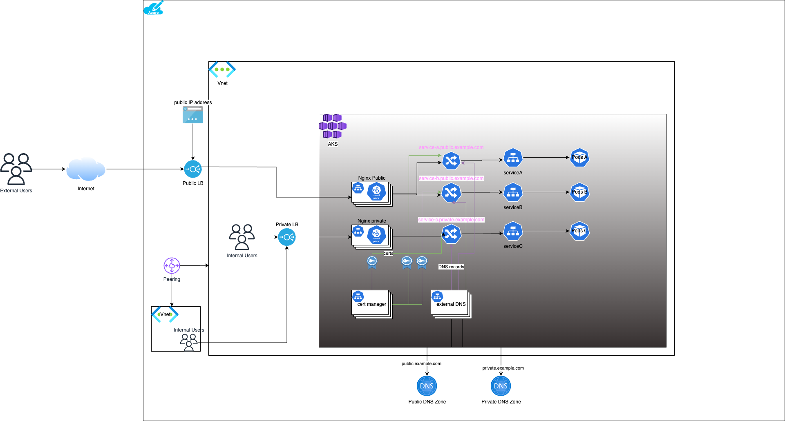

# Ingress-Nginx

## Overview
Manually add the ingress capability in a k8s cluster by installing ingress-nginx using helm.



## Pre-requisites

Before installing the ingress nginx controller, there are several pre-requisites that needs to be met.

### Configure kubectl
In case you are using terraform to provision AKS cluster, you can use the below command to fetch the credentials to configure `kubectl`
```shell
terraform output -raw kube_config_raw > aks_kubeconfig
export KUBECONFIG=aks_kubeconfig
```
### DNS configuration
- DNS Zones must be created (private or public)
- Private DNS zone must be associated with a VNET, so that it can resolve records to IP address from that subnet.
  - Create a Resource Group
  - Create a VNET in that resource group
  - Create a VNET link in the Private DNS Zone and associate it with the VNET above
- Create a `Role Assignment` in the `kubenet MSI` and assign the role `DNS Zone Contributer` or `Private DNS Zone Contributer`. This will give the k8s permission to create/delete records in the Zone.
- The DNS zones would be used by [external-dns](https://github.com/kubernetes-sigs/external-dns/blob/master/docs/tutorials/azure-private-dns.md) module and associated with the ingress controller.

### TLS certificates
In order to enable TLS on the ingress endpoints, we need a way to provision TLS certificates. There are 2 ways we can do this
- Provision certificates outside the `ingress-nginx` and upload them to Azure KeyVault and let the ingress object pull the object from there. The disadvantage of this approach is that these are not auto renewable
- Other approach is to use [Cert Manager](../cert-manager/README.md). Cert Manager provisions certificates automatically whenever a ingress resource is created.

## Installation
The installation details are covered in the document [README](./multiple-ingress-controllers/README.md)

## Important links
- https://adrianhynes.medium.com/exposing-your-aks-workloads-using-external-dns-and-nginx-ingress-controller-434482ea153b
- https://stacksimplify.com/azure-aks/azure-kubernetes-service-externaldns/
- [External-DNS-Azure](https://github.com/kubernetes-sigs/external-dns/blob/master/docs/tutorials/azure-private-dns.md)
- [External DNS](https://github.com/kubernetes-sigs/external-dns)
- [Cert-Manager](https://cert-manager.io/docs/)
