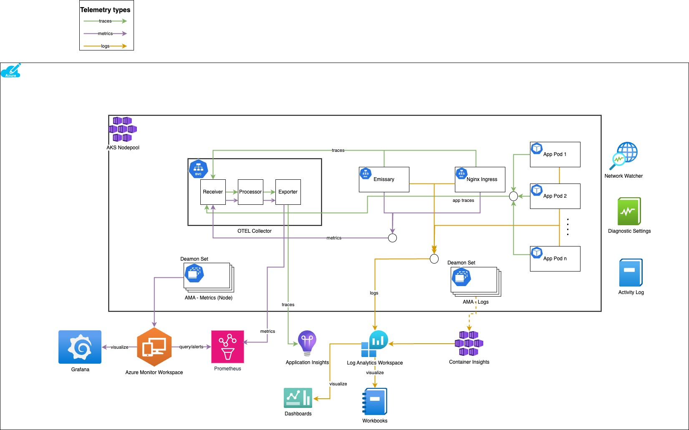
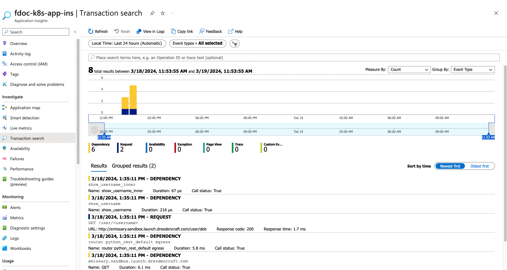
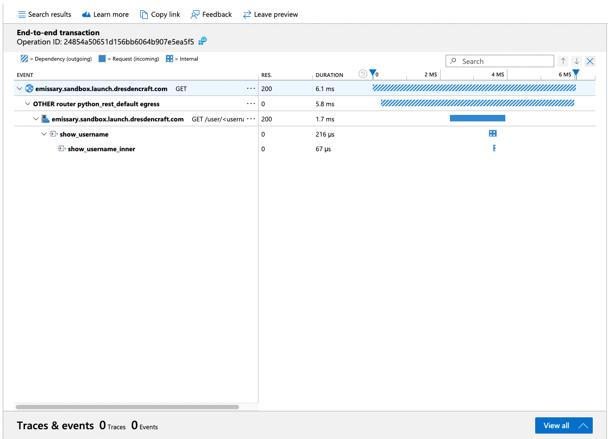

# Observability

Observability is the ability to understand the internal state of a system by examining its outputs. In the context of software,
this means being able to understand the internal state of a system by examining its telemetry data

Observability can be divided into three main categories:
1. **Metrics**: Metrics are a way to measure the health and performance of your application. They are typically numerical
 values that are collected at regular intervals. Examples of metrics include the number of requests per second, the average response time, and the error rate.
2. **Logs**: Logs are a record of events that happen in your application. They are typically text-based and are used to
 help you understand what happened in your application and why. Examples of logs include error messages, warnings, and informational messages.
3. **Traces**: Traces are a way to understand the flow of requests through your application. They are typically used to
 help you understand how long it takes for a request to be processed and to identify any bottlenecks or performance issues in your application.

To make a system observable, it must be instrumented. That is, the code must emit traces, metrics, or logs. The instrumented data must
then be sent to an observability backend.

# Observability in AKS

 [This document](https://learn.microsoft.com/en-us/azure/architecture/microservices/logging-monitoring) provides a good overview
 of the telemetry options in AKS.

## AKS Observability Architecture

The following diagram shows the architecture of observability in AKS.




## Metrics

Metrics are numerical values that can be analyzed. You can use them to observe a system in real time (or close to real time)
or to analyze performance trends over time. To understand a system holistically, you need to collect metrics at various
levels of the architecture, from the physical infrastructure to the application, including:

1. Node-level metrics, including CPU, memory, network, disk, and file system usage. System metrics help you to understand
   resource allocation for each node in the cluster, and to troubleshoot outliers.

2. Container metrics. For containerized applications, you need to collect metrics at the container level, not just at the VM level.

3. Application metrics. These metrics are relevant to understanding the behavior of a service. Examples include the number
   of queued inbound HTTP requests, request latency, and message-queue length. Applications can also use custom metrics that
   are specific to the domain, like the number of business transactions processed per minute.

4. Dependent service metrics. Services sometimes call external services or endpoints, like managed PaaS or SaaS services.
   Third-party services might not provide metrics. If they don't, you need to rely on your own application metrics to track statistics for latency and error rate.

### Metrics collection and analysis in Azure

Azure recommends the following for metrics collection and analysis:
- For cluster and container metrics, enable **Azure Monitor Container Insights**.  When this feature is enabled, Monitor collects
  memory and processor metrics from controllers, nodes, and containers via the Kubernetes Metrics API.
- For application metrics, use Application Insights to collect metrics from your application. This is done by enabling instrumentation
  in application code by using Application Insights SDKs or OpenTelemetry(OTEL) SDKs.

## Logs

In Kubernetes, the standard approach to logging is for a container to write logs to stdout and stderr. The container engine
redirects these streams to a logging driver. To make querying easier, and to prevent possible loss of log data if a node
stops responding, the usual approach is to collect the logs from each node and send them to a central storage location.

Azure Monitor integrates with AKS to support this approach using Container Insights. When enabled, Container Insights installs
a Daemon set of Azure Monitoring Agents (AMA -Log) to collect logs from nodes and send it to Log Analytics workspaces.

From there, you can use the Kusto Query Language to write queries across the aggregated logs like below

```kusto
ContainerLogV2
| where PodName == "podName" //update with target pod
| project TimeGenerated, Computer, ContainerId, LogMessage, LogSource
```

## Traces

Traces, also called operations, connect the steps of a single request across multiple calls within and across microservices.
They can provide structured observability into the interactions of system components. Traces can begin early in the request process,
such as within the UI of an application, and can propagate through network services across a network of microservices that handle the request.

### OpenTelemetry (Otel)

OpenTelemetry is a cross-industry effort to improve tracing by standardizing the interface between applications, libraries,
telemetry, and data collectors. When you use a library and framework that are instrumented with OpenTelemetry, most of the work
of tracing operations that are traditionally system operations is handled by the underlying libraries, which includes the following common scenarios:

- Logging of basic request operations, like start time, exit time, and duration
- Exceptions thrown
- Context propagation (like sending a correlation ID across HTTP call boundaries)

Many of the Azure SDKs have been instrumented with OpenTelemetry or are in the process of implementing it.

`Otel Collectors` can be deployed on k8s clusters to collect traces, logs and metrics from different applications and dependent
services (like Emissary, Nginx Ingress, Service Mesh etc.) and send them to back-end systems like Azure Monitor, Jaeger, etc. for
analysis and visualization.

Otel Collectors constitute of
- Receivers: to collect data from different sources
- Processors: to process the data
- Exporters: to send the data to back-end systems

### Application Insights

Application Insights, a feature of Azure Monitor, excels in Application Performance Management (APM) for live
web applications. It provides many experiences to enhance the performance, reliability, and quality of your applications.

Application Insights can be configured to collect telemetry from Otel Collectors. It connects to the Log Analytics
Workspace where the data is stored. It provides rich visualization and query support.

Application Insights maps the OpenTelemetry context to its internal data model:

- Trace -> Operation
- Trace ID -> Operation ID
- Span -> Request or Dependency


### Our Recommendations
Although Application Insights can be used to directly instrument applications using its sdk and let the apps send data
directly to it, but that would lead to vendor lock-in (the apps could then be used only with Azure Monitor and needs changes
to be used with other tools).
Hence, we  recommend using `Otel SDKs` to instrument applications and `Otel collectors` to collect traces and export them to
Application Insights for visualization and analysis.

### Otel Collector Installation

Otel collector can be installed on Kubernetes using Helm. There are different modes in which the collector can be installed. We would recommend
using `deployment` mode unless we are using Otel collectors to also collect node level metrics from the cluster. In case of later,
we can use `daemon-set` mode.

A [otel-values.yaml](otel-values.yaml) file has been provided with override attributes for collector deployment.

Multiple prometheus targets can be specified if we intend to scrape metrics from different dependent services like Emissary, Nginx Ingress, Service Mesh etc.

```yaml

```shell
helm repo add open-telemetry https://open-telemetry.github.io/opentelemetry-helm-charts
helm repo update

# Install the collector in deployment mode
helm install otel-collector open-telemetry/opentelemetry-collector -f otel-collector-values.yaml

# Command to upgrade (day 2 operations)
helm upgrade otel-collector open-telemetry/opentelemetry-collector -f otel-collector-values.yaml
```

## Distributed Tracing
Distributed tracing is a method used to profile and monitor applications, especially those built using a microservices architecture.

For the end to end distributed tracing to work, the applications need to be instrumented with OpenTelemetry SDKs. Moreover, the
dependent services that the request traverses through (API gateway, service mesh proxies, ingress etc.) or the applications
interact with must also be instrumented. Most of the languages have support for otel auto instrumentation, meaning the OTEL libraries
will take care of adding new spans, propagating the context between service boundaries and adding the necessary metadata to the spans.

A trace includes
1. Span: Think of a span as a single unit of work, such as an operation or interaction, with a unique name and timestamp. Spans
   can contain multiple spans
2. Trace Context: According to the World Wide Web Consortium (W3C), a trace context is a specification that “standardizes how context information is sent and modified between services.” This specification provides a unique identifier to each individual request, which enables you to track vendor-specific metadata even if different tracing tools are used in the same transaction.

Components of Distributed Tracing tools
1. Instrumentation: The process of adding code to your application to collect telemetry data. `Otel SDKs` in our case.
2. Pipeline: The process of collecting, processing, and exporting telemetry data. `Otel Collector Pipelines` in our case.
3. Storage Backend: The system that stores telemetry data. Azure Monitor's `Log Analytics Workspace` in our case.
4. Visualization: The process of viewing and analyzing telemetry data. `Application Insights` in our case.


We will walk through a simple example of how to instrument a python application with Otel SDKs and send the traces to Otel collectors.
In our example, our request will originate when a client invokes the API-gateway (emissary) url to invoke the request. We would also
have our emissary ingress controller instrumented so that the traces originate from the emissary ingress controller.

### Enable tracing on Emissary
Once the Otel Colletor is installed as shown in [Otel Collector Installation](#otel-collector-installation), we can enable tracing on Emissary
by deploying the below CRD.

This will enable Emissary to send traces to the Otel collector on GRPC port `4317`

```yaml
apiVersion: getambassador.io/v3alpha1
kind: TracingService
metadata:
  name: tracing-zipkin
  namespace: emissary
spec:
  service: otel-collector-opentelemetry-collector.default:4317
  driver: opentelemetry
```

### Instrument Python App

There are multiple ways to instrument a python app with several different SDKs. The easiest way is to use the auto-instrumentation
provided by the Otel SDKs. Also, configure the app to send traces to the Otel collector instead of any specific backend.


#### Auto Instrument the app
```bash
from opentelemetry.instrumentation.flask import FlaskInstrumentor

app = Flask(__name__)
FlaskInstrumentor().instrument_app(app)
```

#### Configure the collector

```bash
from opentelemetry.exporter.otlp.proto.grpc.trace_exporter import OTLPSpanExporter
from opentelemetry.sdk.trace.export import BatchSpanProcessor

otlp_exporter = OTLPSpanExporter(insecure=is_insecure)
span_processor = BatchSpanProcessor(otlp_exporter)
trace.get_tracer_provider().add_span_processor(span_processor)
```

### Deploy app on K8s

[Deploy python app](./python-app/README.md) provides all the necessary information on how to build and deploy the app on k8s.

### Visualize Traces

Navigate to Application Insights and visualize the traces under `Investigate -> Transaction Search` section.

#### Search the Transaction



#### View the traces



# References
1. [Otel Official](https://opentelemetry.io/docs/collector/configuration/#receivers)
2. [Otel Collector Github](https://github.com/open-telemetry/opentelemetry-collector/blob/main/receiver/README.md)
3. [Otel ingress-nginx](https://kubernetes.github.io/ingress-nginx/user-guide/third-party-addons/opentelemetry/)
4. [Distributed Tracing in Emissary](https://www.getambassador.io/docs/emissary/latest/howtos/tracing-lightstep)
5. [Otel Collectors](https://github.com/open-telemetry/opentelemetry-collector-contrib)
6. [Distributed Tracing K8s](https://www.cncf.io/blog/2023/03/29/distributed-tracing-in-kubernetes-apps-what-you-need-to-know/)
7. [Auto instrument Python apps](https://opentelemetry-python-contrib.readthedocs.io/en/latest/instrumentation/flask/flask.html)
8. [OLTP Exporter Python](https://opentelemetry-python.readthedocs.io/en/latest/exporter/otlp/otlp.html)
