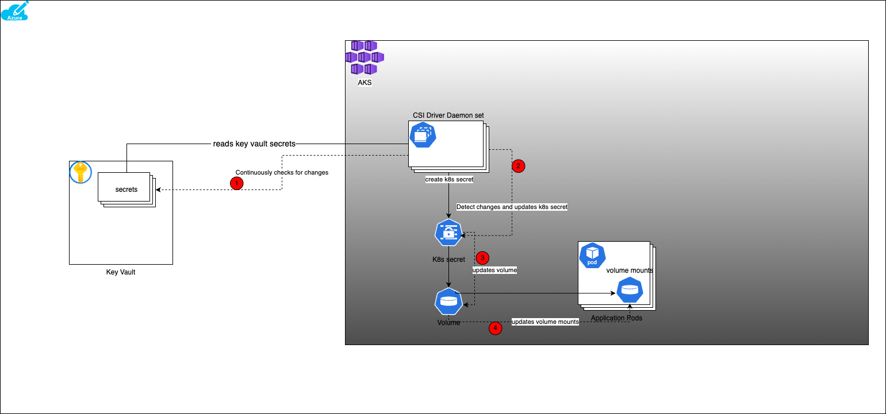

# CSI Driver (Container Storage Interface) for AKS
Secrets Store CSI Driver for Kubernetes secrets - Integrates secrets stores with Kubernetes via a Container Storage Interface (CSI) volume. The Secrets Store CSI Driver is a subproject of Kubernetes [SIG Auth](https://github.com/kubernetes/community/tree/master/sig-auth).
The Secrets Store CSI Driver `secrets-store.csi.k8s.io` allows Kubernetes to mount multiple secrets, keys, and certs stored in enterprise-grade external secrets stores into their pods as a volume. Once the Volume is attached, the data in it is mounted into the container’s file system.

The K8s CSI driver supports multiple providers and Azure is one of them.

## Architecture Diagram



## Enable CSI secret addon in AKS
Azure Key Vault provider for Secrets Store CSI Driver is available as a managed add-on in AKS.

When provisioning through terraform it can be enabled by setting this flag `var.key_vault_secrets_provider_enabled=true`.
This will add a Managed Identity (MSI) for key vault in the node-pool resource group. This custom AKS module creates a key vault automatically in
the AKS resource group and also assigns `Key Vault Administrator` role to the MSI on the newly created key vault.

The below command can be used to assign the roles for other Key vaults, should you choose to use additional key vaults.

```shell
# Object ID of the Key Vault managed identity
IDENTITY_OBJECT_ID=$(terraform  output -json key_vault_secrets_provider | jq -r ".[].object_id")
# The ID of the Key Vault created by this module
KEYVAULT_SCOPE=$(terraform output key_vault_id)
az role assignment create --role "Key Vault Administrator" --assignee $IDENTITY_OBJECT_ID --scope $KEYVAULT_SCOPE

```

Since, the CSI drive is available as a `managed addon for AKS`, we don't have to install the CSI driver manually.
The CSI driver is installed as a `DaemonSet` on the AKS cluster in the `kube-system` namespace.

## Access Secrets from Key Vault in k8s pods
Once the CSI driver add-on is enabled on AKS, the next step would be to create some secrets, keys or certificates in Key Vault and access them from the K8s pods.
In order to do so, you need to create a few secrets in the Key Vault first. That can be done either using the Azure Portal or using the Azure CLI or terraform.

### Create an instance of SecretProviderClass

The CSI driver provides a CRD `SecretProviderClass` that can be used to refer to the key vault and the secrets in it.
Create an instance of  `CRD` [SecretProviderClass](./secret-provider-class.yaml) that would refer the key vault created above and point to various secret/cert/key created in that vault.

At this point a CRD is deployed to the cluster, but no k8s secret objects would be created yet. It is only when a pod/deployment is created that would refer to this
CRD, the k8s secret objects would be created dynamically by the CSI Driver

If ever a situation arrives when all the pods referring to the `SecretProviderClass` are deleted, the k8s secret objects would be deleted automatically by the CSI driver.

### Use the Key Vault secrets in a pod

Create a pod/deployment that would refer to the `SecretProviderClass` to fetch the secrets. Secrets can be accessed in the pods in 2 ways
- **Volume Mount**: The secrets can be mounted as a volume in the pod. The secrets are mounted as files in the pod's file system.
- **Environment Variables**: The secrets can be accessed as environment variables in the pod.

The example [pod](./sample-deployment.yaml) shows how to access the secrets from the key vault using the `SecretProviderClass` created above.

```shell
# Apply the pod manifest
kubectl apply -f sample-deployment.yaml
```

**Note**: A kubernetes secret is automatically created by the CSI driver when a pod is created that would refer to the secrets provided
in the `SecretProviderClass` instance. When there are no pods that refer to the secrets, the k8s secret is automatically deleted by the CSI driver.

### Automatic Secret Rotation
There would be time when the secrets in the key vault would need to be rotated. The CSI driver provides a way to automatically rotate the secrets in the k8s pods.

In order to enable, automatic secret rotation, the following terraform variables need to be set
```terraform
# Enable secret rotation
secret_rotation_enabled = true
# This is the interval in which the CSI driver checks with the key vault for secret rotation. The default is 2 minutes.
secret_rotation_interval = "2m"

```

The CSI driver uses a `pull` method to check for secret changes. It does that by checking the key vault for changes at a regular interval (2 mins by default). When the CSI driver discovers that the secret is changed in the referenced source Key Vault, it will perform the following actions
1. Update the k8s secret with the new value
2. Update the volume with the new value and pod volume mounts are refreshed to reflect the new values.

**Note:** If the secrets are mounted as environment variables, the pod needs to be restarted in order to reflect the new values.
A tool such as [Reloader](https://github.com/stakater/Reloader) can be used to automatically restart the pods when the secrets are updated.

## Conclusion

This is a good solution to manage the secrets in the k8s environment. However, since the rotation strategy is a `pull` method and not event driven,
users can expect a small period where the applications are failing to authenticate because the secrets at the source has changed but the respective pods have not been refreshed by CSI driver yet.

## Important Links
1. [Azure CSI Secret Store](https://learn.microsoft.com/en-us/azure/aks/csi-secrets-store-driver)
2. [CSI Driver Github](https://github.com/kubernetes-sigs/secrets-store-csi-driver)
3. [CSI Driver Concept](https://secrets-store-csi-driver.sigs.k8s.io/concepts.html)
4. [Azure CSI Provider](https://azure.github.io/secrets-store-csi-driver-provider-azure/docs/)
5. [Reloader](https://github.com/stakater/Reloader)
